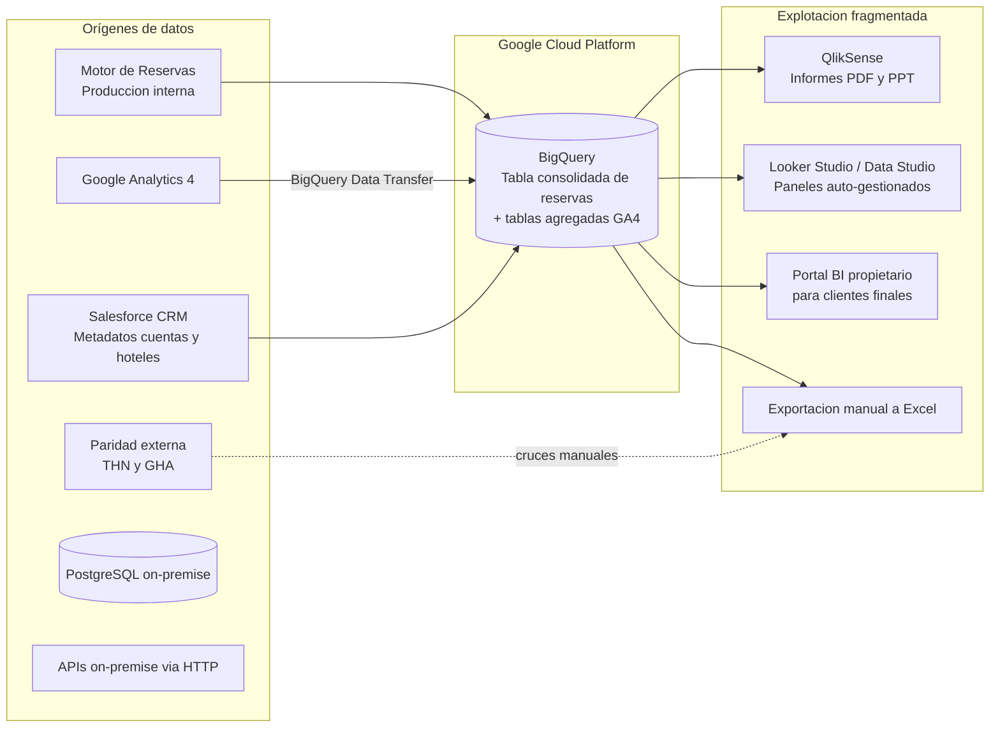
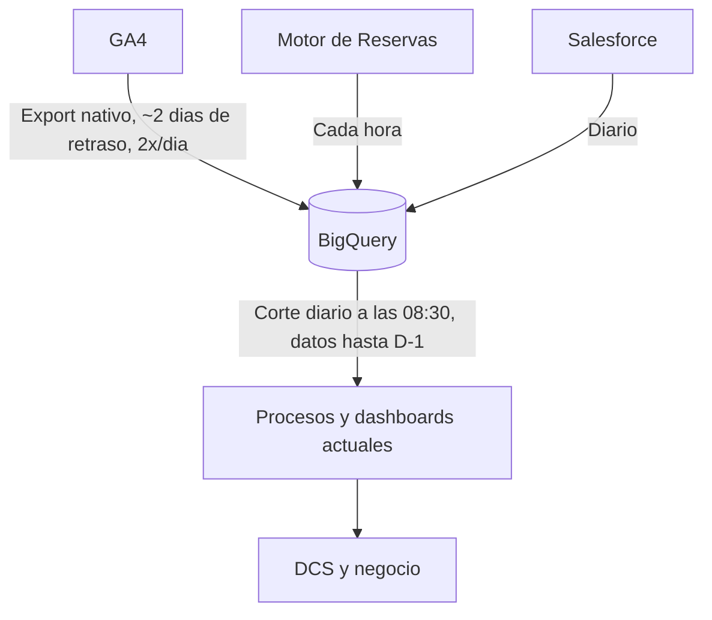

# Roiback — MVP Análisis Cuentas y Forecasting · AS-IS

> Documento base de síntesis generado con la skill `generate-assessment-data-project`.
> Consolida la situación actual (arquitectura, infraestructura, flujos de datos, sistemas y seguridad)
> a partir de las transcripciones de sesiones (`../DISEÑO/sesiones/`), las notas de diagnóstico
> (`../DISCOVERY/`), el esquema `../DISEÑO/campos_dwh.csv` y los borradores existentes.
> Las lagunas se marcan como `<TO_BE_DEFINED>`. No se inventa información.

## 1. Resumen ejecutivo

Roiback dispone de un repositorio analítico central consolidado en **Google BigQuery**, con trazabilidad
en crudo tanto de los eventos digitales (GA4) como del flujo completo de reservas (producción y
cancelaciones). Sin embargo, **el acceso de negocio está muy fragmentado** y **no existe una capa de
gobierno ni una capa semántica común**: cada analista calcula y define métricas a su manera, saltando
entre exportaciones manuales a Excel, un portal BI propietario, QlikSense y decenas de cuadros de mando
de Looker Studio (Data Studio) sin directrices comunes. El diagnóstico de ventas es **manual, reactivo y
subjetivo**, sin reglas automatizadas de alerta.

## 2. Contexto de negocio (resumen)

- Roiback ofrece soluciones para la **venta directa** de cadenas hoteleras y hoteles independientes
  (web oficial + motor de reservas), con el objetivo de hacer crecer el canal directo y reducir la
  dependencia de intermediarios (Booking.com, Expedia).
- Gestiona aproximadamente **600 cuentas** y **~2.200 hoteles activos**.
- El detalle de objetivos y casos de uso se desarrolla en [`DISCOVERY.md`](./DISCOVERY.md).

## 3. Visión general de la arquitectura actual

**Descripción de la topología.** El dato principal reside en BigQuery, pero no hay un gobierno central
para la ingesta ni para la explotación. Los DCS (Direct Channel Specialists / analistas de cuentas)
analizan métricas combinando exportaciones manuales a Excel, el portal BI propietario, QlikSense y
numerosos cuadros de mando aislados de Looker Studio construidos por usuarios sin estándares comunes.

## 4. Stack tecnológico actual

### 4.1. Fuentes de datos

| Fuente | Tipo | Contenido | Notas |
| --- | --- | --- | --- |
| Motor de Reservas | Producción interna | Reservas, transacciones, cancelaciones | ~8.000–9.000 movimientos de reserva/día (alta, modificación, cancelación) |
| Google Analytics 4 | Analítica digital (SaaS) | Tráfico web y búsquedas/disponibilidad del motor | Exportación nativa a BigQuery; Google entrega con ~2 días de retraso |
| Salesforce | CRM | Metadatos de hoteles y cuentas (no del cliente final) | Carga diaria |
| The Hotels Network (THN) / Google Hotels (GHA) | Fuentes externas de paridad | Disparidad de precios frente a OTAs | Integraciones y cruces manuales |
| PostgreSQL on-premise | BBDD relacional | `<TO_BE_DEFINED>` (entidades y volumen) | Acceso futuro vía VPN HA |
| APIs on-premise (HTTP) | APIs | `<TO_BE_DEFINED>` | Acceso futuro vía VPN HA |

### 4.2. Almacenamiento de datos

- **Google BigQuery** como repositorio principal.
- Las interacciones transaccionales se alojan en una **única tabla de reservas consolidada**.
- Los eventos de GA4 se agrupan en **tablas agregadas** (exportación por día y cuenta de Google,
  procesando miles de tablas base para generar una consolidada).
- Volumetría GA4: del orden de **teras** de datos. Volumetría exacta: `<TO_BE_DEFINED>` (Belén
  realizará el análisis con el acceso a Analytics).

### 4.3. Ingesta de datos

- GA4: transferencia nativa (**BigQuery Data Transfer / exportación automática**), tablas de eventos
  divididas por cuenta y día.
- Bookings: la tabla de data warehouse se **actualiza cada hora**, pero todos los procesos posteriores
  (dashboards, cálculos) solo cuentan **hasta la fecha del día anterior**.
- Los procesos del cliente se ejecutan **una vez al día**; a las **08:30** se da todo por actualizado.
  El corte único a esa hora es deliberado para sincronizar zonas horarias (APAC/LATAM) y minimizar
  discrepancias entre cortes.

### 4.4. Procesamiento y transformación

- No existe una capa de transformación gobernada en la nueva plataforma. El procesamiento heredado se
  apoyaba en "Click" (carga una vez al día). No hay Dataform/dbt desplegados aún.

### 4.5. Orquestación y automatización

- No hay orquestador desplegado para la solución analítica objetivo. Los procesos actuales se lanzan
  una vez al día.

### 4.6. Modelado y arquitectura de datos

- No hay arquitectura de medallón ni modelado dimensional gobernado: predomina la **tabla única
  consolidada** de reservas y las **tablas agregadas** de GA4.
- Particionamiento/clustering actual (confirmado por el cliente):
  - Tabla de bookings: **particionada por fecha de última modificación** y **clusterizada por cadena**
    (ordenada por cadena dentro de cada partición).
  - Tabla de eventos (GA4): **particionada por fecha de evento** y clusterizada por cadena.
  - Tablas de Salesforce/maestros: **sin particionar ni clusterizar** (son pequeñas).

### 4.7. Computing y networks

- PostgreSQL y APIs **on-premise**; aún **sin VPN** hacia GCP (se creará una VPN HA en la fase TO-BE).
- El equipo de Devoteam accede a los datos mediante **vistas creadas por Otelo Pons en un proyecto
  específico** que apuntan a otro proyecto (producción). No hay acceso directo a producción.

### 4.8. Explotación de datos (BI & AI/ML)

- **QlikSense**: uso interno avanzado, generación automatizada de informes en PDF/PPT.
- **Looker Studio (Data Studio)**: numerosos paneles auto-gestionados por distintos usuarios/departamentos.
- **Portal BI propietario**: solución ad-hoc para que los clientes finales auditen sus hoteles.
- **Excel**: exportación y análisis manual.
- No hay modelos de ML en producción para anomalías/forecasting/clustering.

## 5. Análisis de flujos de datos

### 5.1. Patrones de ingesta y latencia

- **Bookings**: tabla DWH refrescada cada hora; consumo aguas abajo limitado a D-1.
- **GA4**: dos veces al día, sujeto a lo que Google haya enviado (retraso ~2 días); ocasionalmente
  llegan cambios sobre eventos antiguos.
- **Salesforce**: diario.
- Las modificaciones de reservas pueden afectar a fechas pasadas (settlement hacia atrás), lo que
  obliga a reprocesar histórico dentro de una ventana temporal.

### 5.2. Trazabilidad y ciclo de vida (end-to-end)

- No hay linaje de datos formal desplegado. `<TO_BE_DEFINED>`.

## 6. Gobierno, seguridad y operaciones (AS-IS)

### 6.1. Seguridad y gestión de identidades (IAM)

- Acceso de Devoteam mediante **vistas** en un proyecto dedicado que apuntan a producción; Otelo Pons
  ve el consumo generado por el equipo.
- No hay matriz formal de roles/permisos documentada para la nueva solución. `<TO_BE_DEFINED>`.

### 6.2. Gobierno y calidad del dato

- **Madurez muy baja.** Ninguna herramienta de catálogo/glosario desplegada.
- No hay acuerdo común en definiciones elementales (p. ej. "porcentaje de cancelación") entre ventas,
  analítica y finanzas, lo que genera desajustes numéricos en reportes internos y ante clientes.
- Se ha identificado **Dataplex** como recurso candidato para gobernanza (catálogo, glosario, reglas de
  calidad, perfilado de datos) en la fase de diseño.

### 6.3. Fundamentos de ingeniería y DevOps

- Versionado: se ha validado el uso futuro de **GitLab** (monorepo) para el trabajo analítico.
- **Terraform**: el cliente **aún no ha usado Terraform**; se introducirá en la fase TO-BE.
- IaC, CI/CD, estándares: no formalizados actualmente. `<TO_BE_DEFINED>`.

### 6.4. Monitorización y alertas

- El diagnóstico se basa en un flujo **puramente visual, subjetivo y a posteriori**.
- **No existen reglas automatizadas** que avisen de irregularidades o picos inesperados; todo depende
  del rastreo manual de cada cuenta.

## 7. Análisis de costes y eficiencia (AS-IS)

- Gasto actual en BigQuery: del orden de **~1.000 €/mes** (modelo **bajo demanda**; el cliente **no usa
  reservas/slots**).
- Las consultas sobre las tablas de GA4 (multi-tera) son intrínsecamente costosas.
- Riesgo de incremento de coste con el nuevo proyecto (modelos, agente conversacional, queries de
  análisis "todo contra todo"); se recomienda evaluar **reservas de slots** y límites de bytes por
  query. Estimación detallada: `<TO_BE_DEFINED>` (se probará con cuentas de tamaño pequeño/medio/grande).

## 8. Esquema de datos actual (resumen de `../DISEÑO/campos_dwh.csv`)

| Tabla | Nº campos | Rol | Observaciones |
| --- | --- | --- | --- |
| `bookings` | 158 | Hechos (reservas) | Estructuras anidadas `amounts.{accommodation,packages,services,total}.{producedWithTaxes, producedWithoutTaxes, invoiced...}`, `rooms[]`, `services[]`, `packages[]`, `currency_rate_eur/usd/chain`, `modification_timestamp_hotel`/`modification_timestamp_utc` |
| `tb_data_engine_yes` | 166 | Eventos GA4 (motor) | `country_user`, `fecha_modificacion`, ... |
| `tb_data_engine_no` | 150 | Eventos GA4 (no motor) | `country_user`, `fecha_modificacion`, ... |
| `properties` | 13 | Dimensión (hoteles) | `hotel_country`, ... |
| `accounts` | 12 | Dimensión (cuentas) | `Account_Name`, `Account_Owner`, `Finance_country`, ... |
| `tb_map_country_iso` | 5 | Mapeo de países | `ISO_2_Code`, `ISO_3_code`, `country_BI`, `country_GA4` |

> Nota de calidad: el campo de modificación en `bookings` es `modification_timestamp_utc`/
> `modification_timestamp_hotel`; `fecha_modificacion` solo existe en `tb_data_engine_*`. El TTV se
> calcula sobre `amounts.total.producedWithTaxes` / `amounts.total.producedWithoutTaxes` (ver glosario
> en `DISCOVERY.md`).

## 9. Hallazgos principales (puntos de dolor AS-IS)

1. **Procesos reactivos y subjetivos**: el diagnóstico depende de personas navegando por plataformas
   inconexas; los problemas se abordan cuando las métricas ya han caído (sin alertas en tiempo real).
2. **Ausencia de gobierno y capa semántica**: Shadow IT (Data Studios propios) → métricas
   incongruentes (producción, cancelación) que rompen la confianza en el dato.
3. **Escalabilidad inviable manualmente**: ~600 cuentas y ~2.200 propiedades no se pueden analizar en
   profundidad de forma manual sin descuidar hoteles secundarios.
4. **Fragmentación de la explotación**: Excel + QlikSense + Looker Studio + portal propietario, sin
   "single source of truth".

## 10. Fortalezas de la arquitectura actual

- **Materia prima ya consolidada en GCP/BigQuery**: trazabilidad en crudo de GA4 y del flujo completo
  de reservas (bookings vs cancelaciones).
- **Conocimiento de negocio profundo**: existe una matriz de diagnóstico de 11 pasos muy rica que
  fundamenta el modelo futuro (ver `DISCOVERY.md`).

## 11. Cuestiones abiertas (AS-IS)

- Volumetría exacta de bookings y GA4: `<TO_BE_DEFINED>`.
- Entidades y volumen del PostgreSQL on-premise y de las APIs: `<TO_BE_DEFINED>`.
- Linaje y ciclo de vida del dato actuales: `<TO_BE_DEFINED>`.
- Detalle de roles/permisos IAM actuales sobre el dato: `<TO_BE_DEFINED>`.
