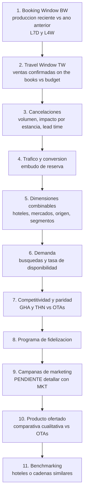

# Roiback — MVP Análisis Cuentas y Forecasting · DISCOVERY

> Documento base de síntesis generado con la skill `generate-assessment-data-project`.
> Consolida objetivos de negocio, casos de uso, requisitos y contexto a partir de las notas de
> diagnóstico (`../DISCOVERY/`), las transcripciones (`../DISEÑO/sesiones/`) y los borradores existentes.
> Para la situación técnica actual ver [`AS-IS.md`](./AS-IS.md). Lagunas marcadas como `<TO_BE_DEFINED>`.

## 1. Contexto de negocio

Roiback es una empresa enfocada en **soluciones para la venta directa** de cadenas hoteleras y hoteles
independientes (vía web oficial y motor de reservas). Su principal objetivo de negocio es **hacer crecer
el canal directo**, reduciendo la dependencia de intermediarios como Booking.com o Expedia. Gestiona los
sistemas de aproximadamente **600 cuentas** y **~2.200 hoteles activos**.

A nivel operativo, el equipo de **DCS (Direct Channel Specialists)** —analistas de cuentas, también
referidos como *account managers*— tiene el reto de gestionar el rendimiento de ventas. El proceso de
análisis, diagnóstico de anomalías y supervisión está **poco estandarizado, es manual, tedioso y
subjetivo**, con la información dispersa entre múltiples herramientas. Además, el modelo es **reactivo**:
las anomalías se detectan revisando métricas pasadas cuando las ventas ya han caído.

## 2. Objetivos estratégicos de negocio

- **Optimización operativa**: reducir el esfuerzo manual y el tiempo de los análisis diarios de
  rendimiento.
- **Estandarización y gobierno del dato**: definir un modelo común de indicadores y métricas para que
  toda la organización "hable el mismo idioma" (interpretación clara y compartida).
- **Gestión proactiva**: pasar de un modelo reactivo a uno **anticipativo**, con alertas tempranas en
  lugar de análisis a posteriori.
- **Escalabilidad**: ejecutar el análisis de forma escalable sobre las ~600 cuentas y ~2.200
  propiedades, detectando problemas incluso a nivel de un único hotel dentro de una cadena.

## 3. Casos de uso prioritarios

> El proyecto se denomina "Análisis de **Cuentas y Forecasting**". Los casos de uso reconcilian los
> recogidos en el Discovery con los desarrollados en Diseño.

| ID | Caso de uso | Descripción | Consumidor | Prioridad |
| --- | --- | --- | --- | --- |
| UC-01 | **Sistema de alertas tempranas** | Notificaciones proactivas (p. ej. vía Slack) ante caídas anómalas de ventas, con enlaces para ampliar la información. | DCS (Direct Channel Specialists) | Alta |
| UC-02 | **Dashboard integral de reunión** | Panel unificado que integra alertas históricas y un resumen automático de IA (tráfico, ventas, año anterior, presupuestos). | DCS | Alta |
| UC-03 | **Forecasting vs. budget** | Pronósticos de ventas (horizonte 3–4 meses) comparados con presupuestos; alerta proactiva si se proyecta no alcanzar objetivo. | DCS / Negocio | Alta |
| UC-04 | **Clustering dinámico de hoteles** | Agrupación de hoteles "similares" (ubicación, tipología, ADR, mercados) recalculada periódicamente para comparativas. | Data / DCS | Media |
| UC-05 | **Analítica conversacional (IA)** | Agente para consultas en lenguaje natural (resúmenes, tendencias, p. ej. top de extras) con verificación de la fuente. | Data / Marketing | Media |

> Nota de trazabilidad: el Discovery original recogía UC-01, UC-02 y "Analítica conversacional". El
> **forecasting** y el **clustering** se han elevado a casos de uso prioritarios en Diseño (el forecasting
> da nombre al proyecto). Confirmar priorización definitiva con Roiback.

## 4. Requisitos del sistema

### 4.1. Requisitos funcionales

- **Diccionario de datos estandarizado**: marco común que asegure fórmulas idénticas (p. ej. definición
  única de "porcentaje de cancelación", TTV, etc.).
- **Centralización del diagnóstico**: unificar en un único entorno las métricas de Booking Window,
  Travel Window, tráfico web, conversión, disponibilidad, paridad de precios y cancelaciones.
- **Comparativas dinámicas consolidadas**: visualizar métricas (TTV, Roomnights…) comparando tramos
  dinámicos simultáneos (p. ej. últimos 7 días vs últimas 4 semanas vs mismo periodo del año anterior).
- **Modelado de agrupaciones (clustering)**: generar automáticamente clusters de propiedades "similares"
  para comparativa de mercado (estacionalidad, destino, etc.).
- **Forecasting de ventas**: pronósticos comparables con budget para activar acciones proactivas.

### 4.2. Requisitos técnicos (no funcionales)

- **Motor de anomalías (ML)**: algoritmo predictivo (p. ej. familia ARIMA) ajustado a las
  particularidades de cada hotel (vacaciones origen/destino, picos naturales), dado que una misma caída
  porcentual no impacta igual a cadenas distintas.
- **Plataforma de gobernanza**: herramienta de metadatos y glosarios (**Dataplex**) para centralizar el
  diccionario semántico entre departamentos.
- **DWH moderno**: estructuración y modelado en **BigQuery**, garantizando entornos unificados que
  sirvan a herramientas visuales y eviten el "Shadow IT" local.
- **Latencia/Frescura del dato**: dato disponible a primera hora (referencia 08:30, datos hasta D-1);
  bookings cada hora, GA4 dos veces al día, Salesforce diario.

## 5. Proceso de diagnóstico de 11 pasos (conocimiento de negocio)

Activo clave del Discovery: matriz de diagnóstico estructurada que fundamenta el modelo futuro.

1. **Booking Window (BW)** — producción reciente (L7D, L4W) vs mismo periodo del año anterior y hoteles
   similares.
2. **Travel Window (TW)** — ventas futuras confirmadas (*on the books*) vs histórico y budget.
3. **Cancelaciones** — volumen, impacto por fecha de estancia y *lead time* de cancelación.
4. **Tráfico y conversión** — distinguir problema de demanda vs problema de conversión.
5. **Dimensiones combinables** — hoteles, mercados, origen de reserva, segmentos de cliente.
6. **Demanda** — búsquedas de disponibilidad y tasa de disponibilidad.
7. **Competitividad y paridad de precios** — disparidades vs OTAs (fuentes GHA/THN).
8. **Programa de fidelización** — registros, captación, ventas del canal fidelizado.
9. **Campañas de marketing** — `<TO_BE_DEFINED>` (pendiente de detallar con el equipo de marketing).
10. **Producto ofertado** — tipologías, condiciones, paquetes/extras vs OTAs.
11. **Benchmarking** — comparativa con hoteles/cadenas similares para contextualizar.

## 6. KPIs principales

Por orden de prioridad: **TTV**, **Roomnights (RN)**, **Reservas/Bookings**; a continuación **ADR**,
**ABV**, **LoS**. Adicionales: **tasa de conversión**, **lead time**.

| KPI | Definición | Estado |
| --- | --- | --- |
| TTV (Total Transaction Value) | Calculado sobre `amounts.total.producedWithTaxes` / `amounts.total.producedWithoutTaxes` (según taxes) × ratio de conversión de moneda (`currency_rate_*`). | Definición de campo confirmada vs esquema |
| Roomnights (RN) | Nº de noches-habitación. | `<TO_BE_DEFINED>` fórmula exacta |
| Reservas / Bookings | Nº de reservas. | `<TO_BE_DEFINED>` criterio (¿netas de cancelación?) |
| ADR (Average Daily Rate) | Ingreso medio por noche. | `<TO_BE_DEFINED>` |
| ABV (Average Booking Value) | Valor medio por reserva. | `<TO_BE_DEFINED>` |
| LoS (Length of Stay) | Duración media de la estancia. | `<TO_BE_DEFINED>` |
| % Cancelación | Sin definición común acordada hoy (punto de dolor clave). | `<TO_BE_DEFINED>` — a estandarizar en el glosario |

## 7. Metodología y stakeholders

### 7.1. Sesiones de trabajo (referenciadas)

| Fecha | Objetivo | Asistentes | Referencia |
| --- | --- | --- | --- |
| 28/04/2026 | Discovery inicial — modelos, métricas y negocio | Devoteam y Roiback | `<no presente en repo>` |
| 29/04/2026 | Discovery 2 — casos de uso y arquitectura fuente | Devoteam y Roiback | `<no presente en repo>` |
| 30/04/2026 | Semanal — Cuentas y forecasting | Devoteam y Roiback | `<no presente en repo>` |
| 12/05/2026 | Daily + Gobierno | Devoteam y Roiback | `../DISEÑO/sesiones/...2026_05_12...` |
| 13/05/2026 | Daily + Diseño | Devoteam y Roiback | `../DISEÑO/sesiones/...2026_05_13...` |
| 22/05/2026 | Daily | Devoteam y Roiback | `../DISEÑO/sesiones/...2026_05_22...` |
| 25/05/2026 | Daily | Devoteam y Roiback | `../DISEÑO/sesiones/...2026_05_25...` |

### 7.2. Stakeholders

| Empresa | Nombre | Rol / Cargo |
| --- | --- | --- |
| Devoteam | Urbano Llamas | Equipo de proyecto |
| Devoteam | Belén Torres | Data Engineer |
| Devoteam | Daniel Acosta | Equipo de proyecto |
| Devoteam | Juan Ezquerro | DevOps / Infraestructura |
| Devoteam | Jose Ortuño (Chema) | Equipo de proyecto / Data Science |
| Roiback | Ana Martín | Equipo de proyecto |
| Roiback | Otelo Pons | Technical Lead / Data |
| Roiback | Irene Soler | DCS (Direct Channel Specialist) |

## 8. Cuestiones abiertas (Discovery)

- Definiciones de fórmulas de KPIs (RN, ADR, ABV, LoS y, especialmente, **% cancelación**): `<TO_BE_DEFINED>`.
- Detalle del caso de uso de campañas de marketing (paso 9): `<TO_BE_DEFINED>`.
- Priorización definitiva de forecasting y clustering frente a alertas/dashboard: confirmar con Roiback.
- Referencias (minutas) de las sesiones de Discovery del 28–30/04: no presentes en el repositorio.
