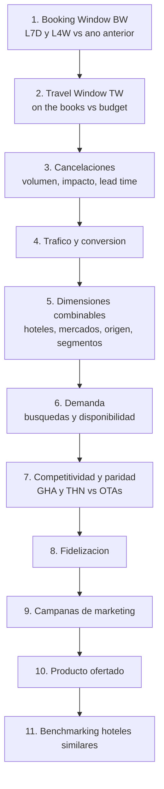
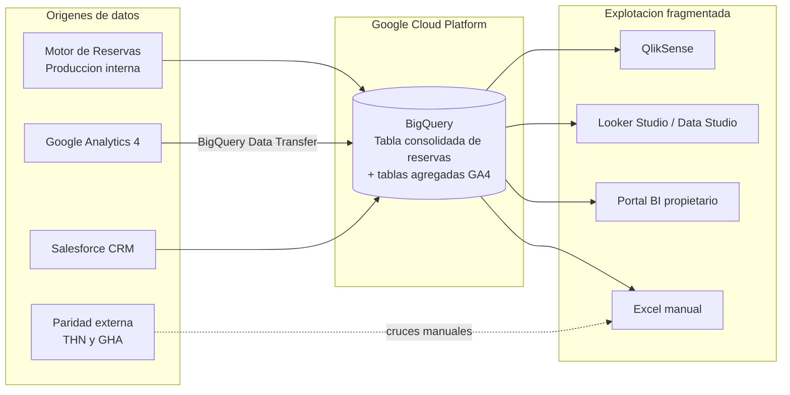
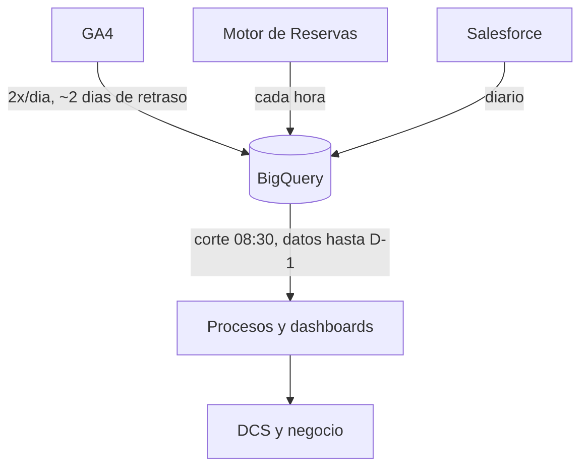

# Roiback - MVP Análisis Cuentas y Forecasting

## Discovery

**Hoja de control**

**Control de documentación**

|  |  |
| :---- | :---- |
| **Document Code** | Roiback - MVP Análisis Cuentas y Forecasting - Entregable Discovery |
| **Preparado por:** | Devoteam (Data Accelerator) |
| **Fecha** | 30/04/2026 |

**Control de versiones**

| Versión | Autor | Fecha | Comentarios |
| :---- | :---- | :---- | :---- |
| v1.0 | Data Accelerator / Devoteam | 30/04/2026 | Versión funcional entregable Discovery |

**Control de revisión y aprobación**

|  | Nombre | Fecha | Firma |
| :---- | :---- | :---- | :---- |
| **Revisado por** |  |  |  |
| **Aprobado por** |  |  |  |

## Índice

1. Introducción y contexto
2. Definición de objetivos y requisitos
3. Análisis de la arquitectura y plataforma actual (AS-IS)
4. Gobierno, seguridad y operaciones
5. Análisis de costes y eficiencia
6. Hallazgos principales y recomendaciones

---

# 1. Introducción y contexto

## 1.1. Propósito del documento

El objetivo de este documento es **formalizar y consolidar los hallazgos** obtenidos durante la fase de
*Discovery* del proyecto **MVP Análisis Cuentas y Forecasting**. Su finalidad es presentar un análisis
integral del estado actual (*AS-IS*) de la infraestructura de datos, la arquitectura y los procesos
operativos de **Roiback** que permita anticipar desafíos técnicos y eliminar suposiciones de cara a la
fase de Diseño.

Este entregable actúa como **herramienta de diagnóstico** orientada a:

- **Garantizar la alineación estratégica**: unificar la visión y expectativas de los stakeholders
  técnicos y de negocio, validando el alcance frente a las necesidades reales detectadas.
- **Formalizar y priorizar objetivos**: identificar objetivos y casos de uso estratégicos y
  transformarlos en requisitos priorizados.
- **Mapear el ecosistema actual**: dar visibilidad sobre las fuentes de datos, flujos de información y
  sistemas existentes.
- **Diagnosticar puntos de dolor y brechas**: identificar ineficiencias técnicas, silos de información y
  limitaciones de la infraestructura actual.
- **Detectar oportunidades de mejora**: proponer líneas de acción y recomendaciones de alto nivel como
  punto de partida para la fase de Diseño y el futuro roadmap.

## 1.2. Contexto de negocio

**Roiback** es una empresa enfocada en **soluciones para la venta directa** de cadenas hoteleras y
hoteles independientes (vía web oficial y motor de reservas). Su principal objetivo de negocio es
**hacer crecer el canal directo**, reduciendo la fuerte dependencia de intermediarios como Booking.com o
Expedia. Gestiona los sistemas de aproximadamente **600 cuentas** y **~2.200 hoteles activos**.

A nivel operativo, el equipo de **DCS (Direct Channel Specialists)** —analistas de cuentas— tiene el
desafío de gestionar el rendimiento de ventas. El proceso de análisis, diagnóstico de anomalías y
supervisión está **muy poco estandarizado, es manual, tedioso y subjetivo**, con la información dispersa
entre múltiples herramientas. Además, el modelo actual es **reactivo**: las anomalías se detectan
revisando métricas pasadas cuando las ventas ya han caído.

**Proceso de diagnóstico actual (matriz de 11 pasos).** El equipo ha documentado un framework de
diagnóstico muy rico que constituye el principal activo de conocimiento del proyecto y que fundamenta la
solución futura:

## 1.3. Metodología y stakeholders involucrados

La metodología empleada durante la fase de Discovery se ha centrado en la **recopilación sistemática de
información** y la colaboración estrecha con el equipo de Roiback, mediante sesiones de trabajo
iterativas estructuradas en torno a: levantamiento de requisitos, auditoría de datos, análisis de
arquitectura y evaluación estratégica.

### 1.3.1. Sesiones de trabajo

| Fecha | Objetivo de la sesión | Asistentes | Referencia |
| :---- | :---- | :---- | :---- |
| 28/04/2026 | Discovery inicial — modelos, métricas y negocio | Devoteam y Roiback | `<TO_BE_DEFINED>` (minuta no disponible en el repositorio) |
| 29/04/2026 | Discovery 2 — casos de uso y arquitectura fuente | Devoteam y Roiback | `<TO_BE_DEFINED>` (minuta no disponible en el repositorio) |
| 30/04/2026 | Semanal — Cuentas y forecasting | Devoteam y Roiback | `<TO_BE_DEFINED>` (minuta no disponible en el repositorio) |

> Nota: las sesiones de la fase de Diseño (12, 13, 22 y 25 de mayo de 2026) se documentan en el
> entregable de Diseño.

### 1.3.2. Stakeholders involucrados

| Empresa | Nombre | Rol / Cargo |
| :---- | :---- | :---- |
| Devoteam | Urbano Llamas | Equipo de proyecto |
| Devoteam | Belén Torres | Data Engineer |
| Devoteam | Daniel Acosta | Equipo de proyecto |
| Devoteam | Juan Ezquerro | DevOps / Infraestructura |
| Devoteam | Jose Ortuño | Equipo de proyecto / Data Science |
| Roiback | Ana Martín | Equipo de proyecto |
| Roiback | Otelo Pons | Technical Lead / Data |
| Roiback | Irene Soler | DCS (Direct Channel Specialist) |

---

# 2. Definición de objetivos y requisitos

## 2.1. Objetivos estratégicos de negocio

- **Optimización operativa**: reducir el esfuerzo manual y el tiempo invertido en los análisis diarios
  de rendimiento, haciéndolos mucho más eficientes.
- **Estandarización y gobierno del dato**: definir un modelo de indicadores y métricas comunes para que
  toda la organización "hable el mismo idioma" y tenga una interpretación clara y compartida.
- **Gestión proactiva**: evolucionar hacia un modelo proactivo y anticipativo, donde los problemas se
  detecten mediante alertas tempranas en lugar de análisis reactivos.
- **Escalabilidad**: realizar el análisis de forma escalable sobre las ~600 cuentas y ~2.200
  propiedades, detectando problemas incluso a nivel de un único hotel dentro de una cadena.

## 2.2. Casos de uso prioritarios

| ID | Caso de uso | Descripción breve | Consumidor | Prioridad |
| :---- | :---- | :---- | :---- | :---- |
| UC-01 | Sistema de alertas tempranas | Notificaciones proactivas (p. ej. vía Slack) ante caídas anómalas de ventas, con enlaces para completar la información. | DCS (Direct Channel Specialists) | Alta |
| UC-02 | Dashboard integral de reunión | Panel unificado que integra alertas históricas y un resumen automático de IA (tráfico, ventas, año anterior y presupuestos). | DCS | Alta |
| UC-03 | Forecasting vs. budget | Pronósticos de ventas (horizonte 3–4 meses) comparados con presupuestos; alerta proactiva si se proyecta no alcanzar objetivo. | DCS / Negocio | Alta |
| UC-04 | Clustering dinámico de hoteles | Agrupación automática de hoteles "similares" (ubicación, tipología, ADR, mercados) para comparativas de mercado. | Data / DCS | Media |
| UC-05 | Analítica conversacional (IA) | Agente conversacional para consultar datos en lenguaje natural (resúmenes, tendencias, p. ej. top de extras), con verificación de la fuente. | Data / Marketing | Media |

## 2.3. Requisitos del sistema

### 2.3.1. Requisitos funcionales

- **Diccionario de datos estandarizado**: marco común que asegure que todos utilizan fórmulas idénticas
  al analizar el negocio (p. ej. definir claramente cómo se calcula el "porcentaje de cancelación").
- **Centralización del diagnóstico**: unificar en un único entorno de análisis las métricas de Booking
  Window, Travel Window, tráfico web, conversión, disponibilidad, paridad de precios y cancelaciones.
- **Comparativas dinámicas consolidadas**: visualizar métricas (TTV, Roomnights…) comparando tramos
  dinámicos de tiempo de forma simultánea (p. ej. últimos 7 días vs últimas 4 semanas vs mismo periodo
  del año anterior).
- **Modelado de agrupaciones (clustering)**: generar automáticamente clusters de propiedades "similares"
  que faciliten la comparativa de mercado (estacionalidad, destino u otros criterios algorítmicos).
- **Forecasting de ventas**: generar pronósticos comparables con el budget para activar acciones
  proactivas.

### 2.3.2. Requisitos técnicos (no funcionales)

- **Motor de anomalías Machine Learning**: algoritmo predictivo (p. ej. familia ARIMA) ajustado a las
  particularidades de cada hotel (vacaciones de origen/destino, picos naturales), ya que una misma caída
  porcentual no impacta igual a cadenas diferentes.
- **Plataforma de gobernanza**: herramienta técnica de metadatos y glosarios (**Google Dataplex**) para
  mantener centralizado el diccionario semántico entre departamentos.
- **Infraestructura DWH moderna**: estructuración y modelado en **Google BigQuery**, garantizando
  entornos unificados que sirvan a las herramientas visuales y eviten el "Shadow IT" local.
- **Frescura del dato**: dato disponible a primera hora del día (referencia 08:30, datos hasta D-1), con
  bookings refrescado cada hora, GA4 dos veces al día y Salesforce a diario.

---

# 3. Análisis de la arquitectura y plataforma actual (AS-IS)

## 3.1. Visión general de la arquitectura

El dato principal de Roiback reside en **Google BigQuery**, pero **el acceso de negocio está muy
fragmentado** y no existe un gobierno central. Los DCS analizan métricas saltando entre la exportación
manual a Excel, un portal BI propietario, QlikSense y decenas de cuadros de mando aislados en Looker
Studio (Data Studio) construidos por usuarios sin directrices comunes.

## 3.2. Stack tecnológico

### 3.2.1. Fuentes de datos

- **Motor de Reservas (producción interna)**: sistemas propios de Roiback de donde se recuperan todas
  las reservas, transacciones y cancelaciones (~8.000–9.000 movimientos de reserva al día).
- **Google Analytics 4 (GA4)**: analítica digital del tráfico web y de las búsquedas/disponibilidad
  dentro del motor de reservas.
- **Fuentes externas de paridad**: The Hotels Network (THN) y Google Hotels (GHA) para supervisar la
  disparidad de precios frente a competidores y OTAs (cruces manuales).
- **CRM**: Salesforce, usado como base de metadatos de hoteles y cuentas (no del cliente final).
- **Conectividad**: las fuentes anteriores ya residen o se transfieren a BigQuery. Existen además un
  **PostgreSQL on-premise** y unas **APIs on-premise (HTTP)** a las que se accederá en la fase TO-BE
  mediante VPN HA. Entidades y volumetría: `<TO_BE_DEFINED>`.

### 3.2.2. Almacenamiento de datos

- **Google BigQuery** es el repositorio principal. Las interacciones transaccionales se alojan en una
  **única tabla de reservas consolidada**; los eventos de GA4 se agrupan en **tablas agregadas**.
- Volumetría GA4 del orden de **teras**. Volumetría exacta: `<TO_BE_DEFINED>`.

### 3.2.3. Ingesta de datos

- **GA4**: transferencia nativa (**BigQuery Data Transfer / exportación automática**), con tablas de
  eventos divididas por cuenta y día.
- **Bookings**: la tabla de DWH se actualiza cada hora, pero el consumo aguas abajo se limita a D-1.
- Procesos del cliente ejecutados **una vez al día**; a las **08:30** se da todo por actualizado (corte
  único deliberado para sincronizar zonas horarias APAC/LATAM y minimizar discrepancias).

### 3.2.4. Procesamiento y transformación

- No existe una capa de transformación gobernada para la nueva solución. El procesamiento heredado se
  apoyaba en "Click" (una carga al día). No hay Dataform/dbt desplegados. `<TO_BE_DEFINED>`.

### 3.2.5. Orquestación y automatización

- No hay orquestador desplegado para la solución analítica objetivo; los procesos se lanzan una vez al
  día. `<TO_BE_DEFINED>`.

### 3.2.6. Modelado y arquitectura de datos

- No existe arquitectura de medallón ni modelado dimensional gobernado: predomina la **tabla única
  consolidada** de reservas y las **tablas agregadas** de GA4.
- Particionamiento/clustering actual:
  - Bookings: particionada por **fecha de última modificación** y clusterizada por **cadena**.
  - Eventos GA4: particionada por **fecha de evento** y clusterizada por **cadena**.
  - Tablas maestras (Salesforce): sin particionar ni clusterizar (volumen pequeño).

### 3.2.7. Computing y networks

- PostgreSQL y APIs **on-premise**, aún **sin VPN** hacia GCP.
- El equipo de Devoteam accede a los datos mediante **vistas creadas por Roiback en un proyecto
  específico** que apuntan al proyecto de producción; no hay acceso directo a producción.

### 3.2.8. Explotación de datos (BI & AI/ML)

- **QlikSense**: uso interno avanzado y generación automatizada de informes en PDF/PPT.
- **Looker Studio (Data Studio)**: numerosos paneles auto-gestionados por distintos usuarios.
- **Portal BI propietario**: solución ad-hoc para que los clientes finales auditen sus hoteles.
- **Excel**: exportación y análisis manual.
- **ML/AI**: sin modelos productivizados de anomalías/forecasting/clustering.

## 3.3. Análisis de flujos de datos

### 3.3.1. Patrones de ingesta y latencia

- **Bookings**: tabla DWH refrescada cada hora; consumo limitado a D-1.
- **GA4**: dos veces al día, sujeto a lo enviado por Google (retraso ~2 días).
- **Salesforce**: diario.
- Las modificaciones de reserva pueden afectar a fechas pasadas (settlement hacia atrás), obligando a
  reprocesar histórico dentro de una ventana temporal.

### 3.3.2. Trazabilidad y ciclo de vida (end-to-end)

- No existe linaje de datos formal desplegado. `<TO_BE_DEFINED>`.

---

# 4. Gobierno, seguridad y operaciones

## 4.1. Seguridad y gestión de identidades (IAM)

### 4.1.1. Análisis de roles y permisos

- El acceso de Devoteam se realiza mediante **vistas** en un proyecto dedicado que apuntan a producción;
  Roiback (Otelo Pons) supervisa el consumo generado. No hay matriz formal de roles documentada para la
  nueva solución. `<TO_BE_DEFINED>`.

### 4.1.2. Gestión de credenciales

- `<TO_BE_DEFINED>` (no se ha desplegado aún una herramienta de gestión de secretos; en Diseño se
  propone Google Secret Manager).

### 4.1.3. Principio de mínimo privilegio

- `<TO_BE_DEFINED>` (a formalizar en la fase de Diseño mediante RBAC y mínimo privilegio).

## 4.2. Organización de recursos cloud

- `<TO_BE_DEFINED>` (la jerarquía de carpetas/proyectos objetivo se define en el entregable de Diseño:
  carpetas Production / Non-Production con proyectos `roiback-dwh-ai-prod` / `roiback-dwh-ai-dev` y
  `roiback-dwh-governance`; los datos de origen residen en `roiback-analytics` y `roiback-web-demand`).

## 4.3. Gobierno y calidad del dato

Existe una **grave deficiencia en la capa de gobernanza y calidad**: distintos usuarios calculan y
definen métricas críticas a su manera.

### 4.3.1. Catálogo de datos y glosario

- **Herramientas**: ninguna desplegada actualmente. Se plantea adoptar **Dataplex** (catálogo, glosario,
  reglas de calidad y perfilado) en la fase de Diseño.
- **Madurez**: muy baja. No hay acuerdo común en definiciones elementales como el "porcentaje de
  cancelación" entre ventas, analítica y finanzas, lo que genera desajustes numéricos en reportes
  internos y ante clientes.

### 4.3.2. Linaje del dato

- No hay capacidades de linaje automatizadas. `<TO_BE_DEFINED>`.

### 4.3.3. Calidad y perfilado del dato

- No existen procesos formales de calidad ni perfilado del dato. `<TO_BE_DEFINED>`.

### 4.3.4. Seguridad del dato (fine-grained access)

- No se aplican RLS/CLS actualmente. No se manejan datos PII en el alcance previsto. `<TO_BE_DEFINED>`.

## 4.4. Fundamentos de ingeniería y DevOps

### 4.4.1. Organización del código (Git)

- Se ha validado el uso futuro de **GitLab** (estrategia monorepo) para el versionado del trabajo
  analítico de la nueva solución.

### 4.4.2. Ciclo de vida y despliegue

- `<TO_BE_DEFINED>` (sin pipeline de CI/CD actual; en Diseño se propone GitLab CI/CD).

### 4.4.3. Infraestructura como código (IaC)

- El cliente **aún no ha utilizado Terraform**. No existe IaC actualmente. En Diseño se propone Terraform
  (con Atlantis y backend remoto en GCS).

### 4.4.4. Estándares y buenas prácticas

- `<TO_BE_DEFINED>` (Devoteam propondrá convenciones de nomenclatura en la fase de Diseño).

## 4.5. Monitorización y alertas

### 4.5.1. Observabilidad técnica

- No existe observabilidad técnica desplegada para la solución analítica. `<TO_BE_DEFINED>`.

### 4.5.2. Alertas y protocolos

- El proceso de diagnóstico actual se fundamenta en un flujo **puramente visual, subjetivo y a
  posteriori**. **No existen reglas automatizadas** que avisen de irregularidades o picos inesperados;
  todo depende del rastreo manual de cada cuenta hotelera.
- No hay alertas de facturación formalizadas (ver sección 5).

---

# 5. Análisis de costes y eficiencia

## 5.1. Orígenes del gasto

- El gasto actual de Roiback en BigQuery es del orden de **~1.000 €/mes**, bajo modelo **on-demand**
  (el cliente **no utiliza reservas/slots**).
- Las tablas de GA4 (multi-tera) son intrínsecamente costosas de consultar (consumo por bytes
  procesados).
- Análisis detallado por usuario/service account mediante `INFORMATION_SCHEMA.JOBS_BY_PROJECT`:
  `<TO_BE_DEFINED>` (el equipo accede vía vistas, sin visibilidad directa del coste de producción).

## 5.2. Oportunidades de optimización

### 5.2.1. Análisis de queries costosas

- `<TO_BE_DEFINED>`. Riesgo identificado: las queries de análisis "todo contra todo" para el nuevo
  proyecto pueden incrementar significativamente el coste; se recomienda materializar por capas y
  acotar el scope.

### 5.2.2. Análisis de uso de slots

- El cliente opera **on-demand**, sin reservas. Se recomienda evaluar **BigQuery Editions (reservas de
  slots)** frente a on-demand una vez se conozca el patrón de consumo del proyecto.
- Cifras por región (bytes procesados / slots medios): `<TO_BE_DEFINED>` (regiones de trabajo: `EU`
  multirregión y `europe-west1`).

### 5.2.3. Análisis de almacenamiento (lógico vs físico)

- `<TO_BE_DEFINED>` (sí es factible extraer costes de almacenamiento a partir de las tablas existentes).

---

# 6. Hallazgos principales y recomendaciones

## 6.1. Resumen de fortalezas de la arquitectura actual

- **Materia prima ya consolidada en GCP/BigQuery**: trazabilidad en crudo tanto de los eventos digitales
  (GA4) como del flujo completo de reservas (bookings vs cancelaciones).
- **Conocimiento de negocio profundo**: matriz de diagnóstico de 11 pasos muy rica (Booking Window,
  Travel Window, paridad, demanda, campañas…) que fundamenta el modelo futuro.

## 6.2. Identificación de puntos de dolor

- **Operativos (procesos reactivos y subjetivos)**: el diagnóstico depende exclusivamente de personas
  navegando por plataformas inconexas; los problemas se abordan cuando las métricas ya han caído, sin
  notificaciones en tiempo real.
- **Gobierno de datos (ausencia de estandarización)**: capa semántica inexistente; el Shadow IT (Data
  Studios propios) genera resultados incongruentes en métricas vitales (producción, cancelación),
  rompiendo la confianza en el dato.
- **Escalabilidad**: gestionar el canal directo de ~600 cuentas y ~2.200 propiedades hace inviable el
  análisis manual en profundidad sin descuidar hoteles secundarios.

## 6.3. Recomendaciones y puntos de mejora

- **Implementación de gobernanza y capa semántica**: centralizar el modelado de datos y desplegar
  **Dataplex** como solución única y dorada (Golden Record) para definiciones como tasas de cancelación
  o TTV. Los reportes (Looker Studio y Qlik) deberán beber exclusivamente de este modelo unificado.
- **Analítica predictiva para alertas**: implementar procesos basados en Machine Learning que asimilen
  la variabilidad estacional y de mercado de cada cadena para disparar **alertas proactivas**,
  reduciendo los tiempos de acción de días a horas.
- **Automatización del framework de 11 pasos**: sustituir el análisis visual transversal de los DCS por
  dashboards centralizados que vinculen de forma nativa la paridad (GHA/THN), la búsqueda web (GA4) y
  las reservas *on the books* (sistema propio), reduciendo la carga operativa.

---

*About Devoteam — Devoteam es una consultora tecnológica especializada en cloud, ciberseguridad, datos y
sostenibilidad. Con más de 25 años como Tech Native y más de 10.000 empleados en más de 25 países de
Europa, Oriente Medio y África, Devoteam acompaña a las empresas en una transformación digital
sostenible, en alianza con las principales plataformas cloud (Google Cloud, Microsoft Azure y AWS).*
