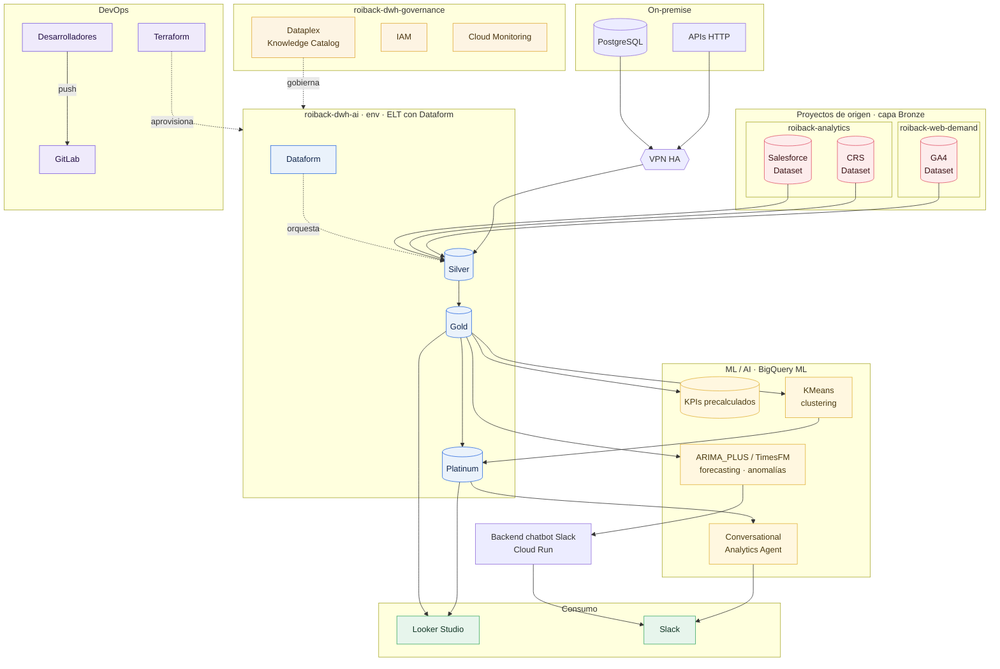
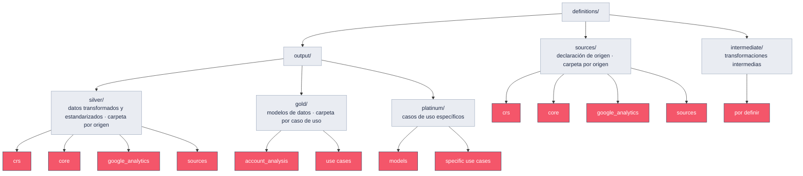
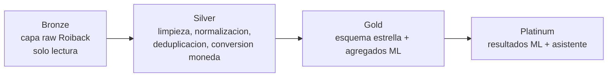
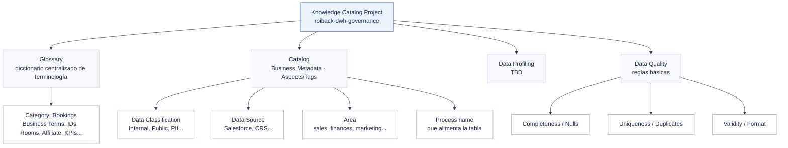

# Roiback - MVP Análisis Cuentas y Forecasting

## Diseño

**Hoja de control**

**Control de documentación**

|  |  |
| :---- | :---- |
| **Document Code** | Roiback - MVP Análisis Cuentas y Forecasting - Entregable Diseño |
| **Preparado por:** | Devoteam (Data Accelerator) |
| **Fecha** | 25/05/2026 |

**Control de versiones**

| Versión | Autor | Fecha | Comentarios |
| :---- | :---- | :---- | :---- |
| v1.0.0 | Data Accelerator / Devoteam | 25/05/2026 | Versión funcional entregable Diseño |

**Control de revisión y aprobación**

|  | Nombre | Fecha | Firma |
| :---- | :---- | :---- | :---- |
| **Revisado por** |  |  |  |
| **Aprobado por** |  |  |  |

## Índice

1. Introducción y contexto
2. Alcance del proyecto
3. Diseño de arquitectura a alto nivel
4. Diseño técnico detallado y flujos de datos
5. Seguridad, gobierno y cumplimiento
6. Estrategia operativa (DevOps)
7. Estrategia de validación y pruebas
8. Estrategia FinOps
9. Conclusiones y próximos pasos

---

# 1. Introducción y contexto

## 1.1. Contexto y antecedentes

El proyecto **MVP Análisis Cuentas y Forecasting** para **Roiback** se estructura en fases consecutivas.
Tras la **fase de Discovery**, donde se levantaron los hallazgos de la situación actual (AS-IS), el
proyecto entra en la **fase de Diseño**, donde se define la arquitectura técnica y funcional futura
(TO-BE). Este documento toma como punto de partida el entregable de **Discovery** previamente aprobado,
que detalla el inventario de datos, los procesos actuales y la deuda técnica existente.

## 1.2. Propósito del documento

El objetivo es **definir la arquitectura técnica** y el **diseño detallado de la solución de datos**. A
partir de los hallazgos validados en Discovery, este entregable traduce los requisitos de negocio en
especificaciones técnicas (TO-BE) y actúa como **guía prescriptiva** para el equipo de desarrollo,
cubriendo: validación contractual, definición de la arquitectura objetivo, guía de implementación y base
documental para el ciclo de vida del proyecto.

---

# 2. Alcance del proyecto

## 2.1. Objetivos estratégicos

- **Detección de anomalías**: sistema de detección de anomalías para las principales métricas de
  negocio (TTV, Roomnights, etc.).
- **Forecasting de ventas**: pronósticos de ventas para comparar con los objetivos y tomar acciones
  proactivas.
- **Clustering de hoteles**: agrupar hoteles con características similares para análisis comparativos.
- **Análisis conversacional**: asistente de IA para consultar datos en lenguaje natural.

## 2.2. Puntos de dolor que resuelve

- **Falta de visibilidad proactiva**: el análisis actual es reactivo; se necesita un sistema que alerte
  automáticamente sobre desviaciones y oportunidades.
- **Ausencia de gobierno y métricas inconsistentes**: el Shadow IT (Looker Studio, Qlik, Excel) produce
  definiciones divergentes de métricas críticas (p. ej. "porcentaje de cancelación"), rompiendo la
  confianza en el dato.
- **Dificultad para comparar hoteles**: no existe una forma sistemática de comparar el rendimiento de
  hoteles similares.
- **Dependencia de equipos técnicos**: los usuarios de negocio no pueden realizar consultas complejas
  por sí mismos, lo que genera cuellos de botella.

## 2.3. Casos de uso prioritarios

- **Detección de anomalías en KPIs**: monitorización continua de métricas clave (TTV, Roomnights,
  Reservas) con alertas en Slack ante desviaciones significativas respecto al comportamiento histórico.
- **Forecasting vs. budget**: pronósticos a 3–4 meses comparados con los presupuestos cargados; alerta
  proactiva si se proyecta no alcanzar el objetivo.
- **Clustering dinámico de hoteles**: modelo que agrupa hoteles por ubicación, tipología, ADR y mercados
  de origen, recalculado periódicamente para análisis comparativos.
- **Asistente conversacional (IA)**: chatbot que permite a los **DCS (Direct Channel Specialists)**
  consultar el rendimiento de los hoteles en lenguaje natural, con respuestas concisas y verificación de
  la fuente.

## 2.4. Requisitos funcionales

- **Fuentes de datos**: capa raw de Roiback en BigQuery.
- **Infraestructura**: despliegue en **GCP**; IaC con **Terraform**; 2 entornos (**DEV** y **PRO**).
- **Procesos y desarrollo**: transformaciones con **Dataform**; orquestación con **Cloud Workflows**;
  modelos de ML con **BigQuery ML**.
- **Visualización/consumo**: dashboards en **Looker Studio (Data Studio)**; alertas en **Slack**;
  asistente conversacional.

## 2.5. Requisitos técnicos (no funcionales)

- **Escalabilidad, rendimiento y disponibilidad**:
  - **Desacoplamiento** de almacenamiento y cómputo para escalado independiente.
  - **Latencia/Frescura**: dato actualizado a las **08:30** con datos de D-1; bookings cada hora, GA4
    dos veces al día, Salesforce a diario.
  - **Disponibilidad** y **volumetría** exactas: `<TO_BE_DEFINED>`.
- **Seguridad y compliance**:
  - **IAM**: principio de mínimo privilegio (PoLP) y RBAC a nivel de servicio y dataset.
  - **Cifrado**: en tránsito (TLS 1.2+) y en reposo con **claves gestionadas por Google (GMEK)**.
  - **Red**: Firewall a nivel de VPC; **VPN en HA** para acceder a un PostgreSQL on-premise y a unas
    APIs.
- **Ingeniería y DevOps**:
  - **IaC** con **Terraform**; **CI/CD** y **versionado** en **GitLab** (monorepo, ramas `main` +
    `features`).
- **Operabilidad y costes**:
  - **Observabilidad** centralizada en **Google Cloud Monitoring/Logging**.
  - **Etiquetado** de facturación (centro de coste, entorno, proyecto) y límite de bytes procesados por
    query.

## 2.6. Exclusiones, supuestos y limitaciones

### 2.6.1. Exclusiones

- No se incluyen datos PII por ahora.
- No se requiere archivado en Cold Storage por el momento.
- No se requiere historización de cambios (SCD Tipo 2).

### 2.6.2. Supuestos

- Los datos de la capa raw de Roiback tienen calidad suficiente para los casos de uso definidos.
- El cliente proporcionará acceso a las fuentes de datos necesarias.
- Los formatos de los datos de origen no cambiarán sin previo aviso.

### 2.6.3. Limitaciones técnicas

- La conexión a fuentes on-premise (PostgreSQL y APIs) depende de la disponibilidad de una VPN en HA.
- BigQuery ML puede tener limitaciones de complejidad de modelos frente a frameworks como TensorFlow o
  PyTorch.

---

# 3. Diseño de arquitectura a alto nivel

## 3.1. Principios de arquitectura

### 3.1.1. Escalabilidad

- **Separación cómputo/almacenamiento** con BigQuery (escalado independiente).
- **Servicios serverless** (Cloud Functions, Cloud Run, Cloud Workflows) que escalan según demanda.

### 3.1.2. Diseño de seguridad

- **Mínimo privilegio (PoLP)** vía IAM.
- **Cifrado** en reposo (GMEK) y en tránsito (TLS 1.2+).
- **Gestión de secretos** con Secret Manager.

### 3.1.3. Automatización

- **IaC** con Terraform; **CI/CD** con GitLab; **orquestación** con Cloud Workflows.

### 3.1.4. Observabilidad

- **Logging** centralizado en Cloud Logging; **monitorización** en Cloud Monitoring; **alertas** a
  Slack.

## 3.2. Diagrama de arquitectura



La arquitectura sigue un patrón **ELT** sobre GCP: los datos se originan en la capa raw de Roiback en
BigQuery (más PostgreSQL y APIs on-premise vía VPN HA), se transforman con **Dataform** siguiendo una
**arquitectura de medallón**, los modelos se entrenan con **BigQuery ML**, y el consumo se realiza vía
**Looker Studio**, **Slack** (alertas) y un **asistente conversacional**.

## 3.3. Descripción de componentes

### 3.3.1. Capa de ingesta y orígenes

- **BigQuery**: la capa raw de Roiback ya reside en BigQuery; no se requiere ingesta tradicional desde
  fuentes externas para el alcance inicial.
- **VPN HA**: para la conexión con PostgreSQL y APIs on-premise.

| Fuente | Entidad | Volumetría | Frecuencia | Método de ingesta |
| :---- | :---- | :---- | :---- | :---- |
| BigQuery (capa raw Roiback) | Bookings, GA4, Salesforce | `<TO_BE_DEFINED>` | Bookings: cada hora · GA4: 2x/día · Salesforce: diario | Nativo en BigQuery |
| PostgreSQL (on-premise) | `<TO_BE_DEFINED>` | `<TO_BE_DEFINED>` | `<TO_BE_DEFINED>` | Vía VPN HA |
| APIs (on-premise) | `<TO_BE_DEFINED>` | `<TO_BE_DEFINED>` | `<TO_BE_DEFINED>` | Vía VPN HA |

### 3.3.2. Capa de procesamiento y lógica de negocio

- **Batch**: transformaciones y reentrenamiento de modelos en lotes. Actualizaciones diarias, con
  fuentes de mayor frecuencia (cada hora, 2x/día).
- **Arquitectura híbrida**: para dashboards podrá disponerse de datos intra-día; las alarmas se
  ejecutarán con menor frecuencia (1–2 veces al día).

### 3.3.3. Capa de persistencia y almacenamiento

- Patrón **Medallón** (Bronze, Silver, Gold, Platinum) sobre **BigQuery** como motor unificado.
- **Ciclo de vida (ILM)**: sin archivado a Cold Storage por el momento.
- **Metadatos/gobierno**: **Dataform** (documentación y linaje) y **Dataplex** (catálogo, glosario y
  calidad).

### 3.3.4. Capa de consumo

- **BI/Reporting**: **Looker Studio (Data Studio)** sobre modelos certificados (capa Gold) como "single
  source of truth".
- **Analítica avanzada**: **BigQuery ML**.
- **Alertas**: **Slack** (anomalías y forecasting; se evaluará adjuntar gráficos).
- **Asistente conversacional (IA)**: consultas en lenguaje natural con verificación de la fuente.

## 3.4. Decisiones de diseño

| Decisión | Opción elegida | Alternativa descartada | Justificación |
| :---- | :---- | :---- | :---- |
| Orquestación | Cloud Workflows | Cloud Composer | Solución serverless y de menor coste; la complejidad actual no justifica Composer. |
| Transformación | Dataform | dbt | Integración nativa con BigQuery, con linaje y control de versiones sin coste adicional. |
| Machine Learning | BigQuery ML | Vertex AI, Scikit-learn | Entrenamiento/despliegue con SQL en BigQuery; adecuado para forecasting, anomalías y clustering. |
| Gestión de código | GitLab | GitHub, Bitbucket | Herramienta utilizada actualmente por el cliente. |
| IaC | Terraform | Pulumi, CloudFormation | Herramienta preferida por el cliente. |
| Orquestador de IaC | Atlantis | Despliegue manual | Automatiza los despliegues de Terraform vía Pull Requests en GitLab. |

---

# 4. Diseño técnico detallado y flujos de datos

## 4.1. Stack tecnológico

| Capa | Tecnología | Justificación |
| :---- | :---- | :---- |
| Ingesta | BigQuery, VPN HA | La capa raw ya reside en BigQuery; la VPN conecta fuentes on-premise. |
| Almacenamiento | BigQuery | Data warehouse serverless, escalable e integrado en GCP. |
| Transformación | Dataform | SQL con control de versiones, testing y linaje integrado. |
| Explotación | Looker Studio, Slack, Asistente IA | Herramientas ya usadas por el cliente + nueva interfaz de IA. |
| Orquestación | Cloud Workflows | Orquestador serverless, económico y suficiente. |
| MLOps | BigQuery ML | Simplifica el ciclo de vida de los modelos al estar integrado en BigQuery. |

## 4.2. Diseño de data pipelines

### 4.2.1. Estrategia de carga de datos

- **Tipo de carga**: **incremental** para tablas de hechos (basada en `modification_timestamp_utc` en
  bookings y `fecha_modificacion` en las tablas de GA4) y **full refresh** para tablas maestras.
- **Frecuencia**: Bookings cada hora · GA4 2x/día · Salesforce diario · resto de procesos 1x/día (con
  posibilidad de aumentar la frecuencia para dashboards).
- **Reprocesamiento**: cargas "Full" bajo demanda vía parámetros del orquestador. Carga inicial de
  histórico de **2–3 años** de bookings y GA4 (ventana exacta `<TO_BE_DEFINED>` según necesidades del
  modelo).

### 4.2.2. Estrategia de transformación de datos

Enfoque **ELT**: los datos ya están en BigQuery (capa raw) y se transforman con **Dataform**
aprovechando el cómputo de BigQuery, con control de versiones, tests y documentación.



### 4.2.3. Estrategia de calidad del dato

- **Framework**: **Assertions de Dataform** + **Data Quality jobs de Dataplex**.
- **Controles**: nulos, duplicados e integridad referencial (reglas específicas en implementación).
- **Manejo de errores**: detener pipeline, alertar o mover a cuarentena según criticidad.
- **Notificaciones**: canal de **Slack**.

### 4.2.4. Estrategia de orquestación de datos

- **Cloud Workflows** (definido como código YAML, versionado en GitLab) orquesta los pipelines de
  Dataform.
- **Agrupación** por dominio de negocio y frecuencia; nomenclatura `[frecuencia]_[dominio]_[accion]`
  (p. ej. `daily_sales_gold`, `hourly_bookings_silver`).
- **Dependencias**: intra-pipeline con `ref()` de Dataform; inter-pipeline con triggers de Workflows.
- **Resiliencia**: 3 reintentos con backoff exponencial para errores transitorios; los errores fatales
  detienen el pipeline y notifican. Canales: `#data-ops-logs` (warning) y alerta al equipo técnico de
  Roiback (critical).

## 4.3. Arquitectura de datos



### 4.3.1. Capa Bronze

- Corresponde a la **capa raw de Roiback** ya existente en BigQuery; el rol de Devoteam es de
  **consumidor (solo lectura)**.
- **Tablas relevantes**: `bookings`, GA4 (`tb_data_engine_yes` / `tb_data_engine_no`), `accounts`,
  `properties`, `tb_map_country_iso`.
- **Campos de modificación**: `modification_timestamp_utc` / `modification_timestamp_hotel` en
  `bookings`; `fecha_modificacion` en las tablas de GA4. Las dimensiones (`accounts`, `properties`) no
  disponen de estos campos.

### 4.3.2. Capa Silver

- **Limpieza y normalización**: gestión de nulos según recomendación del modelo (imputación, `N/A`,
  `-1`); unificación de tipos (fechas a `TIMESTAMP`); **conversión de moneda** con `currency_rate_eur`,
  `currency_rate_usd` y `currency_rate_chain`.
- **Estandarización de país**: mapeo mediante `tb_map_country_iso` (`country_BI`, `country_GA4`) para BI.
- **Deduplicación**: por claves primarias de cada tabla.
- **Reglas de negocio**: exclusión de reservas de prueba y de estados nulos/pendientes.
- **Historización (SCD)**: no se aplica SCD Tipo 2 en esta fase.

### 4.3.3. Capa Gold

- **Modelado**: **esquema en estrella** para dashboards de BI y tablas agregadas para ML.
- **KPIs prioritarios**: TTV, ADR, LoS, ABV, Lead Time, Roomnights (RN), Tasa de Conversión.
- **Cálculo de TTV**: sobre `amounts.total.producedWithTaxes` o `amounts.total.producedWithoutTaxes`
  (según taxes) multiplicado por el ratio de conversión de moneda correspondiente.
- **Consumo**: Looker Studio se conecta a esta capa. Definición detallada de tablas/campos:
  `<TO_BE_DEFINED>` (en curso).

### 4.3.4. Capa Platinum

| Informe / Dashboard | Origen datos | Formato salida | Actualización |
| :--- | :--- | :--- | :--- |
| Alertas de anomalías | `gold.kpi_anomalies` | Mensaje en Slack | Según se detecten |
| Alertas de forecasting | `gold.kpi_forecast` | Mensaje en Slack | Diaria |
| Clusters de hoteles | `gold.hotel_clusters` | Tabla en BigQuery | Periódica (semanal) |
| Asistente conversacional | Capa Gold y Platinum | API | Bajo demanda |

## 4.4. Modelo de datos físico y optimización

### 4.4.1. Diagrama de entidad-relación (ERD)

- `<TO_BE_DEFINED>` (se elaborará durante la fase de implementación).

### 4.4.2. Estrategia de historización (SCD)

- No se implementará historización (SCD Tipo 2) en esta fase.

### 4.4.3. Estrategia de particionamiento y clustering

| Entidad / Tabla | Campo de partición | Granularidad | Campo de clustering | Justificación |
| :--- | :--- | :--- | :--- | :--- |
| `fact_bookings` | `modification_timestamp_utc` | Día | `chain`, `hotel_id` | Las consultas se filtran por fecha; el clustering acelera el análisis por cadena y hotel. |
| `fact_ga4` | `fecha_modificacion` (o fecha de evento) | Día | `chain` | Las consultas se filtran por fecha; el clustering por cadena mejora el rendimiento. |

---

# 5. Seguridad, gobierno y cumplimiento

## 5.1. Organización de recursos y jerarquía

```text
Organization: roiback.com
├── Folder: Production
│   ├── Project: roiback-dwh-ai-prod        # DWH + ML/AI (producción)
│   └── Project: roiback-dwh-governance     # catálogo y gobierno del dato
└── Folder: Non-Production
    └── Project: roiback-dwh-ai-dev         # DWH + ML/AI (desarrollo)

# Proyectos de origen existentes (capa Bronze, solo lectura):
#   roiback-analytics    -> Salesforce, CRS (reservas)
#   roiback-web-demand   -> GA4
```

**Etiquetado**: se definirán etiquetas para `environment`, `cost_center` y `owner` (detalle
`<TO_BE_DEFINED>`).

## 5.2. Gestión de identidades y accesos a datos

### 5.2.1. Estrategia de autenticación

- **Usuarios**: acceso vía **cuentas IAM** de Google. El equipo técnico de Roiback (3 personas) tendrá
  acceso.
- **Service Accounts**: una por entorno y componente (p. ej. Dataform), siguiendo el mínimo privilegio.

### 5.2.2. Matriz de roles y permisos

- `<TO_BE_DEFINED>` (matriz detallada en implementación; se crearán grupos de usuarios para gestionar
  permisos).

### 5.2.3. Gestión de secretos y credenciales

- **Almacenamiento**: **Google Secret Manager**.
- **Rotación**: según las políticas de seguridad de Roiback.

### 5.2.4. Seguridad granular del dato

- No se requiere RLS ni CLS en esta fase, al no manejarse datos PII.

### 5.2.5. Protocolo de acceso de emergencia (*glass breaker*)

- Se definirá más adelante si es necesario. `<TO_BE_DEFINED>`.

## 5.3. Estrategias de cifrado

### 5.3.1. Cifrado en tránsito

- Todo el tráfico entre servicios de GCP cifrado por defecto (TLS 1.2+).

### 5.3.2. Cifrado en reposo

- BigQuery y Cloud Storage cifrados con **claves gestionadas por Google (GMEK)**, suficiente para el
  cliente.

### 5.3.3. Gestión de claves de cifrado (KMS)

- Se utilizarán GMEK; las políticas de rotación son las definidas por Google.

## 5.4. Seguridad de red y perímetro

### 5.4.1. Arquitectura de red

- **Región principal**: decisión pendiente entre `europe-west1` (acceso a los últimos modelos de ML) y
  `EU` (multirregión, donde residen los datos). `<TO_BE_DEFINED>` tras análisis de pros/contras.

### 5.4.2. Conectividad híbrida

- **VPN en HA** para acceder a un PostgreSQL on-premise y a unas APIs.

### 5.4.3. Seguridad de red y controles

- **Firewall** a nivel de VPC. **No** se utilizará WAF en este proyecto.

## 5.5. Gobierno del dato

### 5.5.1. Descubrimiento y clasificación

- No se manejarán datos PII en esta fase; no se requiere Sensitive Data Protection.

### 5.5.2. Gestión de metadatos y catálogo de datos

- **Herramienta**: **Dataplex (Dataplex Catalog)** para catálogo y gestión de metadatos.
- **Alcance**: activos de BigQuery.
- **Enriquecimiento**: plantillas de etiquetas con contexto de negocio (dominio, criticidad, owner).
- **Automatización**: integración de **Dataform** con Dataplex para documentar tablas y columnas.



### 5.5.3. Glosario de negocio

- Glosario en **Dataplex** durante la implementación, con los Data Stewards/Owners de Roiback. Devoteam
  proveerá una plantilla.

### 5.5.4. Linaje de datos y trazabilidad

- **Dataform** generará automáticamente el linaje a nivel de tabla, visualizable en Dataform y en
  Dataplex. No se activará la API de linaje de BigQuery por el momento (control de costes).

### 5.5.5. Perfilado estadístico y calidad del dato

- Reglas de calidad básicas con **assertions de Dataform** y **Data Quality de Dataplex**. Reglas y
  umbrales concretos `<TO_BE_DEFINED>` (en implementación, por caso de uso). Alertas a Slack o dashboard.

### 5.5.6. Políticas de ciclo de vida

- No se implementarán políticas de ciclo de vida en esta fase (no necesario según el cliente).

## 5.6. Cumplimiento y normativas

### 5.6.1. Residencia y soberanía del dato

- Datos procesados y almacenados en `EU` (multirregión) o `europe-west1`, en cumplimiento de GDPR.

### 5.6.2. Matriz de cumplimiento normativo

- Cumplimiento de **GDPR** (aunque no se manejen datos PII en esta fase). Otras normativas aplicables:
  `<TO_BE_DEFINED>`.

### 5.6.3. Auditoría y evidencias

- `<TO_BE_DEFINED>` (se apoyará en Cloud Audit Logs; detalle a definir en implementación).

---

# 6. Estrategia operativa (DevOps)

## 6.1. Estándares y prácticas de ingeniería

### 6.1.1. Convenciones de nomenclatura

- Devoteam propondrá convenciones para recursos de GCP y objetos de datos (tablas, vistas, columnas),
  validadas con Roiback. `<TO_BE_DEFINED>`.

## 6.2. Infraestructura como código (IaC)

### 6.2.1. Estrategia y herramientas

- **Terraform** como herramienta estándar; **Atlantis** como orquestador de IaC vía Pull Requests en
  GitLab.

### 6.2.2. Gestión del estado

- Estado de Terraform en **bucket remoto de GCS** con versionado y bloqueo habilitados.

### 6.2.3. Modularización y reutilización

- `<TO_BE_DEFINED>` (módulos reutilizables a definir en implementación).

## 6.3. Estrategia de CI/CD y gestión de versiones

### 6.3.1. Control de versiones

- **GitLab**, estrategia **monorepo**.

### 6.3.2. Estrategia de branching

- **Main + Features**: una rama por funcionalidad/corrección, fusionada a `main` vía Pull Request.

### 6.3.3. Pipeline de CI/CD

- **GitLab CI/CD**; entornos **DEV** y **PRO** (ampliables bajo demanda).

## 6.4. Observabilidad

### 6.4.1. Definición de métricas

- **6.4.1.1. Operativas**: latencia, tasa de error de pipelines.
- **6.4.1.2. Calidad del dato**: volumen, nulos, duplicados.
- **6.4.1.3. Infraestructura**: uso de CPU/recursos, coste.

### 6.4.2. Estrategia de monitorización y dashboards

- **Google Cloud Monitoring**; dashboards de `Pipelines health`, `Data quality`, `Infraestructura` y
  `FinOps / Costes`.

### 6.4.3. Estrategia de logging y auditoría

- Logs centralizados en **Google Cloud Logging**. Retención específica: no requerida por el momento.

### 6.4.4. Matriz de alertas y respuestas

- **Canal**: Slack.
- **CRITICAL**: fallos en pipelines, integridad comprometida → notificación al equipo técnico de Roiback.
- **WARNING**: anomalías en KPIs, degradación de calidad → canal de Slack.
- Se implementará **priorización de alertas** para no saturar al equipo de DCS.

---

# 7. Estrategia de validación y pruebas

Se definirán planes detallados por categoría durante la implementación.

- **7.1. Pruebas unitarias**: lógica de transformación en Dataform.
- **7.2. Pruebas de integración**: ejecución de pipelines orquestados con Cloud Workflows.
- **7.3. Pruebas de calidad del dato**: `assertions` de Dataform.
- **7.4. Pruebas de carga y rendimiento**: escalado de la solución.
- **7.5. Pruebas de seguridad y acceso**: roles y permisos de IAM.
- **7.6. Pruebas de aceptación de usuario (UAT)**: grupo piloto de 4–5 personas del equipo DCS sobre un
  conjunto definido de hoteles clave.

---

# 8. Estrategia FinOps

## 8.1. Estimación de costes

- `<TO_BE_DEFINED>`: estimación detallada en implementación, probando con cuentas de tamaño pequeño,
  mediano y grande para proyectar costes. Coste de referencia actual: ~1.000 €/mes (on-demand).

### 8.1.1. Estrategia de precios y ediciones (BigQuery Editions)

- Se evaluará **BigQuery Editions (reservas de slots)** frente a on-demand, especialmente por el uso
  intensivo de queries para ML. Una reserva puede reducir significativamente el coste.

## 8.2. Política de presupuestos y gobernanza financiera

- Presupuestos y alertas en Google Cloud una vez se disponga de estimación. Acción ante exceso: notificar
  al equipo responsable (`<TO_BE_DEFINED>` por Roiback).

## 8.3. Gestión de límites de consumo y cuotas

### 8.3.1. Límites de coste por usuario y proyecto

- Límite de bytes procesados por query para evitar consultas costosas; las service accounts de Dataform
  quedarán exentas. Límites concretos `<TO_BE_DEFINED>`.

### 8.3.2. Cuotas técnicas del proveedor (capacity planning)

- No se prevé aumento de cuotas de API. Regiones `EU` y `europe-west1`, verificando disponibilidad de
  cuota en cada una.

---

# 9. Conclusiones y próximos pasos

Este diseño cubre los requisitos establecidos y ofrece una base sólida para la implementación de la
plataforma de datos de Roiback.

**Próximos pasos inmediatos:**

1. Aprobación formal de este documento por parte de Roiback.
2. Desarrollo del **Roadmap** de implementación: estudio de la brecha AS-IS → TO-BE, detalle,
   estimación y temporalización de actividades, y dimensionamiento del equipo y costes de construcción y
   mantenimiento.

---

*About Devoteam — Devoteam es una consultora tecnológica especializada en cloud, ciberseguridad, datos y
sostenibilidad. Con más de 25 años como Tech Native y más de 10.000 empleados en más de 25 países de
Europa, Oriente Medio y África, Devoteam acompaña a las empresas en una transformación digital
sostenible, en alianza con las principales plataformas cloud (Google Cloud, Microsoft Azure y AWS).*
