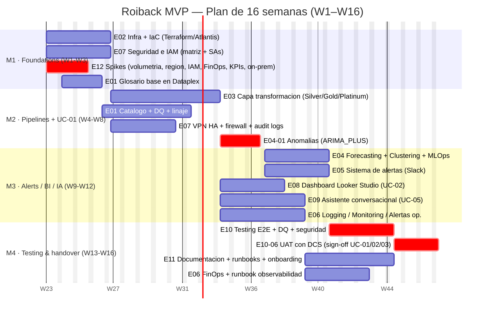

# Plan del proyecto — Roiback MVP Análisis Cuentas y Forecasting

> **Documento maestro de planificación.** Recoge alcance, objetivos, casos de uso,
> equipo, epics, hitos, dependencias, riesgos y gobernanza para la fase de
> Implementación del MVP. Es el documento de referencia narrativo del plan; el
> detalle task-por-task (estimaciones, dependencias finas, asignaciones) se
> mantiene en la WBS canónica y en el backlog de Jira (`ROIB`).
>
> **Fase actual:** Implementación (16 semanas).
> **Documentos base:** Discovery (AS-IS) y Diseño (TO-BE) ya aprobados.
> **Versión:** v1.0 — Plan de implementación.

---

## Introducción y contexto

**Roiback** es una compañía especializada en la **distribución directa hotelera**,
con una posición consolidada en el canal directo de cadenas hoteleras y un
volumen relevante de tráfico y reservas gestionado a diario a través de sus
motores de reservas, integraciones con CRM (Salesforce), GA4 y sistemas
operacionales propios (CRS y servicios on-premise). El equipo de **DCS (Direct
Channel Specialists)** —analistas de cuentas— es el principal consumidor de los
indicadores de rendimiento de hoteles y necesita pasar de un modelo de **análisis
reactivo** (revisión manual de paneles y exportes) a un modelo **proactivo y
gobernado**, apoyado en alertas tempranas, forecasting comparado contra budget,
clustering de hoteles comparables y un asistente conversacional.

El proyecto **MVP Análisis Cuentas y Forecasting** se estructura en tres fases
consecutivas:

1. **Discovery (AS-IS).** Levantamiento de la situación actual, inventario de
   fuentes, deuda técnica y huecos de gobernanza. Cerrada y documentada en
   `docs/[Roiback] - MVP Análisis Cuentas y Forecasting - Discovery.md`.
2. **Diseño (TO-BE).** Definición de la arquitectura objetivo en Google Cloud
   Platform —medallón Silver/Gold/Platinum sobre BigQuery, Dataform como motor
   ELT, Cloud Workflows como orquestador, BigQuery ML para modelos, Looker
   Studio para BI y Slack como canal de alertas—. Cerrada y documentada en
   `docs/[Roiback] - MVP Análisis Cuentas y Forecasting - Diseño.md`.
3. **Implementación.** Es la fase que cubre este plan. Tiene una duración
   estimada de **16 semanas (W1–W16)** y se divide en **cuatro hitos** (M1–M4)
   que se describen más abajo.

Este plan **no redefine** lo ya acordado: lo ejecuta. Toma como insumo el WBS
canónico (12 epics, 64 tasks, ~280 story points) y lo proyecta sobre un
cronograma y una operativa de equipo. Todas las cuestiones abiertas se siguen
centralizando en `docs/TO_BE_DEFINED.md` (38 items, agrupados en bloques
temáticos resolubles en talleres y spikes), y los spikes que desbloquean M2
quedan recogidos en el epic **HBE0002-E12**.

---

## Alcance del proyecto

El alcance de la fase de Implementación cubre la **construcción end-to-end** de
la plataforma analítica TO-BE descrita en el Diseño y los **cuatro casos de uso
prioritarios** acordados con Roiback, en un MVP funcional sobre dos entornos
(**DEV** y **PRO**) y dos proyectos GCP de datos (`roiback-dwh-ai-prod` y
`roiback-dwh-ai-dev`) más un proyecto de gobernanza (`roiback-dwh-governance`).

**Entra en alcance:**

- **Infraestructura como código** completa con Terraform + Atlantis y CI/CD en
  GitLab (epic E02), incluyendo módulos reutilizables y backend remoto.
- **Capa de ingestión y transformación** medallón con Dataform — modelos Silver,
  Gold (esquema estrella con KPIs canónicos: TTV, RN, ABV, ADR, LoS, %
  cancelación) y Platinum (salidas ML-ready y de consumo) (epic E03).
- **Modelos de Machine Learning** en BigQuery ML: detección de anomalías
  (ARIMA\_PLUS), forecasting (ARIMA\_PLUS / TimesFM con fallback) y clustering
  (KMeans) con pipeline de reentrenamiento orquestado (epic E04).
- **Sistema de alertas** sobre Slack (`#data-alerts`, `#forecast-warnings`,
  `#data-ops-logs`) y dashboard histórico de alertas (epic E05).
- **Observabilidad y FinOps**: Cloud Logging/Monitoring centralizados,
  dashboards de pipelines y costes, análisis on-demand vs Editions y budgets
  con alertas (epic E06).
- **Seguridad y cumplimiento**: matriz IAM TO-BE, service accounts por
  componente/entorno, Secret Manager, VPN HA hacia el on-premise, firewall,
  Cloud Audit Logs y políticas (epic E07).
- **Dashboard integral de reunión** en Looker Studio para UC-02 (epic E08) y
  **asistente conversacional** sobre Cloud Run con integración Slack para UC-05
  (epic E09).
- **Gobernanza del dato**: glosario de negocio y catálogo en Dataplex, Data
  Quality, linaje (epic E01).
- **Validación y handover**: testing (unitario, integración, calidad, carga,
  seguridad), **UAT con grupo piloto DCS** y documentación + onboarding del
  equipo técnico de Roiback (epics E10 y E11).

**Queda fuera de alcance** del MVP (exclusiones del Diseño §2.6.1, que se
mantienen vigentes):

- **No se incluyen datos PII**. La arquitectura no contempla ofuscación,
  pseudonimización ni controles RLS/CLS finos sobre PII en esta fase. Si
  Roiback decide incorporar PII en una fase futura, requerirá un rediseño de
  seguridad.
- **No se incluye Cold Storage** ni archivado de larga duración: los datos
  permanecen en BigQuery con su política nativa de retención por tabla.
- **No se implementa SCD Tipo 2** (historización de cambios) en las
  dimensiones del esquema estrella. Las dimensiones son SCD Tipo 1
  (sobreescritura) salvo que un caso de uso del MVP requiera lo contrario.
- No se cubre el rediseño de las fuentes de origen (CRS, web-demand, etc.):
  Roiback mantiene la responsabilidad de las capas de origen y de los accesos
  vía vistas y service accounts.

---

## Objetivos estratégicos

El MVP persigue los **cuatro objetivos estratégicos** que fija el Diseño en
§2.1 y a los que se subordinan todos los casos de uso y la arquitectura
TO-BE:

1. **Detección de anomalías.** Sistema automatizado de detección de
   desviaciones significativas sobre las principales métricas de negocio
   (TTV, Roomnights, Reservas) por hotel y cadena, sobre la base de
   modelos ARIMA\_PLUS entrenados por entidad y con un objetivo de F1 > 0.75
   en validación. Materializa **UC-01**.
2. **Forecasting de ventas.** Pronósticos a 3–4 meses comparados con el
   budget cargado, con alerta proactiva en Slack si la proyección queda fuera
   de banda ±10 %. Objetivo de RMSE < 10 %. Materializa **UC-03**.
3. **Clustering de hoteles.** Agrupamiento dinámico de hoteles por
   ubicación, tipología, ADR y mercados de origen, recalculado semanalmente
   con un objetivo de silueta > 0.5. Materializa **UC-04** y alimenta la
   comparativa entre hoteles del dashboard.
4. **Análisis conversacional.** Asistente de IA que permite a los DCS
   consultar el rendimiento de los hoteles en lenguaje natural, con
   verificación explícita de la fuente (`source_table`, `query_timestamp`,
   `confidence`). Materializa **UC-05**.

Estos cuatro objetivos están alineados con los puntos de dolor levantados en
Discovery: falta de visibilidad proactiva, ausencia de gobierno y métricas
inconsistentes, dificultad para comparar hoteles y dependencia del equipo
técnico para consultas no triviales.

---

## Casos de uso prioritarios

El MVP entrega cinco casos de uso. UC-01, UC-02 y UC-03 son **prioridad Alta**
y forman el núcleo de valor para el equipo DCS; UC-04 y UC-05 son **prioridad
Media** y refuerzan el conjunto.

| UC    | Nombre                                | Prioridad | Consumidor       | Epics que lo entregan                                          |
| :---- | :------------------------------------ | :-------- | :--------------- | :------------------------------------------------------------- |
| UC-01 | Sistema de alertas tempranas          | Alta      | DCS              | E03, E04, E05 (E04-01, E05-01, E05-02)                          |
| UC-02 | Dashboard integral de reunión         | Alta      | DCS              | E03, E04, E08, E09 (resumen IA en E08-04)                       |
| UC-03 | Forecasting vs. budget                | Alta      | DCS / Negocio    | E03, E04, E05 (E04-02, E05-03)                                  |
| UC-04 | Clustering dinámico de hoteles        | Media     | Data / DCS       | E03, E04 (E04-03)                                               |
| UC-05 | Analítica conversacional / IA         | Media     | Data / Marketing | E03, E09 (E09-01..04)                                           |

> El mapeo task-a-task (delivery map) se mantiene en la sección
> _Use-case → tasks_ de la WBS canónica (`/tmp/roiback-wbs.md`). No se duplica
> aquí para evitar deriva.

Cada caso de uso tiene **un consumidor de referencia identificado por nombre**
en Roiback (Irene Soler para los flujos DCS) y un **sign-off** que se obtiene
durante la UAT en M4 (task **HBE0002-E10-06**).

---

## Equipo y stakeholders

El proyecto se ejecuta con un equipo mixto **Devoteam + Roiback** de ocho
personas. Devoteam aporta la arquitectura, ingeniería de datos, DevOps, data
science y dirección de proyecto; Roiback aporta el conocimiento de negocio,
los accesos a las fuentes y la validación funcional.

| Rol                                   | Nombre              | Empresa  | Responsabilidad principal                                                            |
| :------------------------------------ | :------------------ | :------- | :----------------------------------------------------------------------------------- |
| Equipo de proyecto / Arquitectura     | Daniel Acosta       | Devoteam | PM principal, arquitectura, FinOps; conduce E11, E06 (FinOps), spikes E12-02/04.     |
| Data Engineer (lead)                  | Belén Torres        | Devoteam | Lead de datos: Dataform, Dataplex, BI, Slack; conduce E01, E03, E05, E08.            |
| DevOps / Infraestructura              | Juan Ezquerro       | Devoteam | Lead de infra y seguridad: Terraform/Atlantis, GitLab CI/CD, IAM, VPN, observabilidad. |
| Data Science                          | Jose Ortuño (Chema) | Devoteam | Lead ML/IA: BigQuery ML, reentrenamiento, asistente conversacional (E04, E09).        |
| Equipo de proyecto                    | Urbano Llamas       | Devoteam | Apoyo PM, control de plan y comunicación con stakeholders Roiback.                    |
| Equipo de proyecto                    | Ana Martín          | Roiback  | PM Roiback y negocio: priorización, validación de KPIs, escalado interno.             |
| Technical Lead / Data                 | Otelo Pons          | Roiback  | AS-IS, accesos a fuentes, vistas, integraciones on-premise; co-dueño de spikes E12-01/06. |
| DCS (Direct Channel Specialist)       | Irene Soler         | Roiback  | UAT y validación funcional con el grupo piloto DCS (UC-01, UC-02, UC-03).             |

Como **RACI simplificado**:

- **Accountable** del MVP frente a Roiback: Daniel Acosta (Devoteam) / Ana
  Martín (Roiback).
- **Responsible** de la entrega técnica: leads por área (Belén / Juan / Chema).
- **Consulted**: Otelo Pons sobre cualquier integración con el origen.
- **Informed**: el grupo piloto DCS, vía Irene Soler.

---

## Plan de trabajo: epics

La fase de Implementación se descompone en **12 epics** (`HBE0002-E01..E12`) y
**64 tasks**. Cada epic está asociado a uno o más hitos (M1–M4), tiene una
asignación de área canónica y un mapeo a los casos de uso que entrega. El
detalle de tasks vive en la WBS y en Jira; en este plan trabajamos a nivel
de epic.

| External ID | Nombre                                                | Área principal              | Hito(s) | UCs                | Nº tasks |
| :---------- | :---------------------------------------------------- | :-------------------------- | :------ | :----------------- | :------- |
| HBE0002-E01    | Fundaciones de gobernanza y datos                     | Governance / Data Eng       | M1–M2   | todos              | 4        |
| HBE0002-E02    | Infraestructura y IaC (Terraform + Atlantis)          | DevOps / Infra              | M1      | todos              | 5        |
| HBE0002-E03    | Capa de transformación (Dataform + Cloud Workflows)   | Data Eng                    | M2      | UC-01/02/03/04     | 7        |
| HBE0002-E04    | Machine Learning y modelos (BigQuery ML)              | ML/AI / Data Science        | M2–M3   | UC-01/03/04        | 5        |
| HBE0002-E05    | Sistema de alertas (Slack + Cloud Workflows)          | Data Eng / Observability    | M3      | UC-01              | 5        |
| HBE0002-E06    | Observabilidad, monitorización y FinOps               | DevOps / FinOps             | M3–M4   | todos              | 6        |
| HBE0002-E07    | Seguridad, IAM y cumplimiento                         | Security / Governance       | M1      | todos              | 7        |
| HBE0002-E08    | Dashboard integral de reunión (UC-02)                 | BI / Data Eng               | M3      | UC-02              | 4        |
| HBE0002-E09    | Asistente conversacional (UC-05)                      | ML/AI / Data Eng            | M3      | UC-05              | 4        |
| HBE0002-E10    | Validación, testing y UAT                             | QA / Testing                | M4      | todos              | 6        |
| HBE0002-E11    | Documentación y handover                              | PM / Documentation          | M4      | todos              | 5        |
| HBE0002-E12    | Spikes y decisiones pendientes                        | PM / Architecture           | M1      | todos (desbloquea) | 6        |

Notas sobre la estructura:

- **E02 y E07 son cimientos.** Sin la infraestructura provisionada (E02-01..04)
  y la matriz IAM (E07-01..02) ningún otro epic puede ejecutarse de forma
  reproducible. Se arrancan en W1.
- **E12 es transversal** y existe para sacar del camino crítico las decisiones
  pendientes. Sus seis spikes se ejecutan en paralelo en M1.
- **E01 acompaña a E03**: el glosario y el catálogo se construyen a medida que
  se materializa la capa Gold; la entrega final de glosario consolidado vive en
  E11-03 (M4).
- **E11 es de cierre**, pero la documentación de arquitectura y runbooks
  comienza a redactarse en paralelo desde M3 para evitar acumular deuda al
  final.

---

## Hitos y cronograma (16 semanas)

El proyecto se entrega en **cuatro hitos** de duración asimétrica, alineados
con la lógica de construcción incremental "primero fundamentos, luego datos,
luego inteligencia, luego validación". Las semanas son **relativas al
kickoff** (W1 = primera semana de implementación tras la firma del plan); no
se compromete ninguna fecha absoluta en este documento.

### M1 — Foundations (W1–W3, 3 semanas)

**Objetivo.** Dejar la plataforma lista para construir: jerarquía de
proyectos en GCP, Terraform + Atlantis operativos, matriz IAM TO-BE
aprobada, glosario base en Dataplex y todas las decisiones bloqueantes
resueltas vía spikes.

**Epics activos:** E02 (completo), E07 (matriz IAM y service accounts), E12
(los seis spikes), E01 parcial (glosario inicial).

**Salidas esperadas:**

- Proyectos GCP `roiback-dwh-ai-prod`, `roiback-dwh-ai-dev` y
  `roiback-dwh-governance` provisionados bajo la jerarquía `roiback.com`.
- Backend remoto de Terraform en GCS con state versionado y bloqueado.
- Atlantis funcionando contra el monorepo de GitLab (PRs con auto-plan).
- Módulos Terraform reutilizables (`bq_dataset`, `iam_roles`,
  `cloud_workflows`, `secret_manager`, `monitoring`) publicados.
- Etiquetado de facturación (`environment`, `cost_center`, `owner`) y
  límites de bytes por query.
- Matriz IAM TO-BE aprobada (grupos `data-engineers`, `analysts-dcs`,
  `ml-engineers`, `devops-team`, `business-users`); service accounts por
  componente y entorno; Secret Manager configurado.
- Glosario base en Dataplex con ≥50 términos validados por Roiback.
- **Todos los spikes de E12 resueltos** (volumetría, región, IAM, costes,
  KPIs/Gold y on-premise) con decisiones documentadas y firmadas.

### M2 — Pipelines + first UC (W4–W8, 5 semanas)

**Objetivo.** Tener funcionando el primer caso de uso (UC-01, alertas
tempranas) sobre una capa medallón completa. Es el hito de **prueba real de
la cadena de datos**.

**Epics activos:** E03 completo, E04-01 (anomalías ARIMA\_PLUS), E01
(catálogo + Data Quality + linaje), E07 cierre (VPN HA, firewall, audit
logs si aplica).

**Salidas esperadas:**

- Proyecto Dataform inicializado con estructura medallón y un modelo de
  ejemplo en cada capa.
- Transformaciones Silver operativas (`silver/{crs,core,google_analytics,
  sources}`) con deduplicación, conversión de moneda y filtros de prueba.
- Capa Gold poblada con esquema estrella, KPIs canónicos (TTV, RN, ABV,
  ADR, LoS, % cancelación) y particionado/clustering correctos.
- Capa Platinum poblada parcialmente (anomalías).
- Orquestación con Cloud Workflows (`hourly_bookings_silver`,
  `daily_sales_gold`, `daily_ml_platinum`) y triggers de Cloud Scheduler.
- Modelo de anomalías entrenado y validado (F1 > 0.75).
- Catálogo Dataplex enriquecido y reglas de Data Quality activas
  (15+ reglas, gating de pipeline ante DQ crítica).
- VPN HA con conectividad probada hacia el PostgreSQL y APIs on-premise.

### M3 — Alerts / BI / IA (W9–W12, 4 semanas)

**Objetivo.** Materializar el resto de casos de uso: alertas en Slack (UC-01
extendido y UC-03), dashboard integral (UC-02), clustering (UC-04) y
asistente conversacional (UC-05).

**Epics activos:** E04 (forecasting y clustering), E05 completo, E08
completo, E09 completo, E06 (logging, monitoring, alertas operativas).

**Salidas esperadas:**

- Integración Slack viva (`#data-alerts`, `#forecast-warnings`,
  `#data-ops-logs`) con secrets gestionados.
- Notificaciones de anomalías (UC-01) y de forecasting vs. budget (UC-03)
  publicando con la payload acordada y el gating de priorización.
- Alertas de pipeline (CRITICAL/WARNING) operativas.
- Dashboard de Looker Studio (UC-02) con 5+ visualizaciones, filtros por
  hotel/cadena/período, aprobado preliminarmente con DCS.
- Modelos de forecasting y clustering publicados a Platinum
  (`gold.kpi_forecast`, `gold.hotel_clusters`) con cadencia de
  reentrenamiento.
- Backend del chatbot desplegado en Cloud Run con verificación de fuente y
  bot de Slack integrado; conjunto de 10 queries validadas con DCS.
- Cloud Logging centralizado, dashboards de Cloud Monitoring (Pipelines
  Health, Data Quality, Infrastructure, FinOps) y alertas operativas.

### M4 — Testing & handover (W13–W16, 4 semanas)

**Objetivo.** Validar la solución de extremo a extremo, ejecutar UAT con
DCS, dejar runbooks y documentación operativa y traspasar el conocimiento
al equipo técnico de Roiback.

**Epics activos:** E10 completo, E11 completo, E06 cierre (FinOps,
runbook), E01-04 (linaje final).

**Salidas esperadas:**

- Test suites unitarios de Dataform pasando.
- Pruebas E2E (Bronze → Silver → Gold → BI) con datos reales.
- Pruebas de calidad del dato, carga/rendimiento (objetivo < 2 min en
  queries representativas) y de seguridad/IAM.
- **UAT con grupo piloto DCS (4–5 personas)** y sign-off de Roiback sobre
  UC-01, UC-02 y UC-03.
- Documento de arquitectura final, runbooks operativos
  (pipeline failure, DQ alert, cost spike, Dataform deploy, chatbot
  debugging), glosario final en Dataplex.
- Onboarding del equipo técnico Roiback (3 sesiones) y notebooks de
  ejemplo.
- Go-live formal del MVP.

### Diagrama Gantt (16 semanas)

> Nota: las fechas absolutas del diagrama son ilustrativas (arrancando un
> lunes ficticio) y sirven sólo para representar la duración relativa. Las
> fechas reales se fijarán en el kickoff.

---

## Dependencias clave

La planificación tiene un **camino crítico marcado por la infraestructura y
por los spikes**. Si M1 se desliza, todos los hitos posteriores se desplazan
en bloque, porque la capa de datos no puede construirse sobre proyectos GCP
no provisionados ni con una matriz IAM no aprobada. Por debajo se sintetizan
las dependencias críticas:

- **E02 (Infra/IaC) bloquea todo lo demás.** Sin proyectos GCP, sin backend
  de Terraform y sin Atlantis no es posible desplegar Dataform, Cloud
  Workflows ni ningún componente posterior.
- **El glosario de E01-01 alimenta E01-02 (catálogo Dataplex) y la capa
  Gold de E03-03.** Sin definiciones canónicas de TTV, RN, ABV, etc., el
  esquema estrella se construye con métricas inconsistentes (es uno de los
  puntos de dolor que precisamente queremos cerrar).
- **La capa Gold (E03-03) bloquea ML (E04) y BI (E08).** Los tres modelos
  (anomalías, forecasting, clustering) consumen Gold; los dashboards de
  Looker Studio también. Cualquier inestabilidad en Gold se propaga.
- **La capa Platinum (E03-04) depende de la publicación de modelos (E04-05).**
  Es la única dependencia inversa relevante entre E03 y E04: Platinum es
  donde aterrizan las salidas de ML.
- **Los spikes de E12 desbloquean M2.** Volumetría (E12-01), región
  (E12-02), IAM (E12-03), costes (E12-04), KPIs/Gold (E12-05) y on-premise
  (E12-06) deben estar resueltos en W3 para evitar retrabajo en M2.
- **La integración on-premise (E07-04, VPN HA) depende de E12-06.** Sin la
  estrategia on-premise definida y validada con Otelo Pons, la VPN se
  diseña a ciegas.

Mini-tabla con las dependencias críticas entre epics:

| Dependencia                                | Origen      | Destinos                                | Riesgo si se rompe                                              |
| :----------------------------------------- | :---------- | :-------------------------------------- | :-------------------------------------------------------------- |
| Infra base                                 | E02         | E01, E03, E04, E05, E07, E08, E09, E06  | Bloqueo total de M2.                                            |
| Glosario y definiciones canónicas          | E01-01      | E01-02, E01-03, E03-03                  | Métricas inconsistentes en Gold, retrabajo BI/ML.                |
| Capa Gold (esquema estrella + KPIs)        | E03-03      | E04 (anomalías, forecasting, clustering), E08 | Modelos ML y dashboard sin base; retraso de UC-01/02/03.        |
| Publicación de modelos a Platinum          | E04-05      | E03-04                                  | UC-04 y UC-05 sin datos ML-ready.                                |
| Spikes desbloqueantes                      | E12-01..06  | M2 (todo)                               | Decisiones tardías → retrabajo en infra y data model.            |
| Estrategia on-premise                      | E12-06      | E07-04                                  | VPN HA diseñada sin requisitos reales.                           |
| Matriz IAM aprobada                        | E07-01      | E07-02..03, todos los SA de servicio    | Service accounts mal dimensionadas; deuda de seguridad.          |

---

## Spikes y cuestiones abiertas

El proyecto arranca con **38 cuestiones abiertas** registradas en
`docs/TO_BE_DEFINED.md` (20 originadas en Discovery, 18 en Diseño). El
documento las agrupa en cinco bloques temáticos para resolverlas en talleres
conjuntos. La fase de Implementación canaliza la resolución de las más
bloqueantes a través de **seis spikes** del epic **HBE0002-E12**, todos ellos
ejecutables en M1 (W1–W3):

- **HBE0002-E12-01 — Volumetría** (Belén). Estimación cuantitativa de la capa
  raw: bookings, GA4 y on-premise. Resuelve **D-02, D-03, S-01, S-02, S-03**.
- **HBE0002-E12-02 — Región** (Daniel). Decisión `europe-west1` vs `EU`
  multirregión, balanceando disponibilidad de modelos ML, residencia del
  dato y cumplimiento. Resuelve **S-10**.
- **HBE0002-E12-03 — Taller de seguridad e IAM** (Juan). Define la matriz de
  roles TO-BE, gestión de credenciales y mínimo privilegio. Resuelve
  **D-07, D-08, D-09, S-08, S-09**.
- **HBE0002-E12-04 — Análisis de costes** (Daniel). Benchmark on-demand vs
  Editions con cuentas chica/mediana/grande, análisis de queries costosas y
  almacenamiento lógico vs físico. Resuelve **S-16, S-17, S-18, D-17, D-18,
  D-19, D-20**.
- **HBE0002-E12-05 — Definición de KPIs y esquema Gold** (Chema). Cierra la
  definición de tablas, campos y ERD de la capa Gold. Resuelve **S-05, S-06**.
- **HBE0002-E12-06 — Estrategia on-premise** (Juan). Confirma entidades,
  volumetrías y frecuencias del PostgreSQL y de las APIs; condiciona la VPN
  HA. Resuelve **S-03**.

### T-shirt list — items que **deben** resolverse antes de M2

Sin estos items, M2 arranca con riesgo de retrabajo significativo. Se
incluyen también algunos `TO_BE_DEFINED` que no están directamente en E12
pero que comparten origen temático:

| ID(s)                    | Tema                                          | Tamaño | Spike que lo resuelve |
| :----------------------- | :-------------------------------------------- | :----- | :-------------------- |
| D-02, D-03               | Volumetría on-prem y GA4                      | M      | E12-01                |
| S-01, S-02               | SLA + volumetría raw                          | S      | E12-01                |
| S-03                     | Entidades on-premise (PostgreSQL + APIs)      | M      | E12-01 + E12-06       |
| S-10                     | Región principal (EU vs europe-west1)         | S      | E12-02                |
| D-07, D-08, D-09         | Matriz IAM y gestión de credenciales TO-BE    | M      | E12-03                |
| S-08, S-09               | Grupos de usuarios + glass-breaker            | S      | E12-03                |
| D-17, D-18, D-19, D-20   | Costes (jobs, queries, almacenamiento, región) | L      | E12-04                |
| S-16, S-17, S-18         | Estimación detallada + responsables + límites | M      | E12-04                |
| S-05, S-06               | Tablas/campos Gold + ERD                      | M      | E12-05                |
| S-04                     | Ventana histórica inicial (2 vs 3 años)       | S      | E12-05 (acompaña)     |
| S-07                     | Valores concretos de etiquetado               | S      | E12-04 (acompaña)     |
| S-14, S-15               | Convenciones de nomenclatura + modularización IaC | S  | Se cierra con E02-04   |

Los items **D-13** (RLS/CLS) y **D-10** (jerarquía cloud) ya están resueltos
o parcialmente resueltos en el Diseño y no bloquean M2.

Adicionalmente, el epic E09 incluye un **spike de arquitectura del asistente
conversacional** (**HBE0002-E09-01**): elección de LLM (Vertex AI / Claude /
Gemini) y patrón RAG sobre BigQuery. Este spike no bloquea M1 ni M2 pero
debe estar resuelto antes de empezar a construir el backend del chatbot en
M3.

El detalle completo de los 38 items, con responsables sugeridos y estado, se
mantiene en `docs/TO_BE_DEFINED.md`, que es el registro vivo durante toda
la implementación.

---

## Riesgos y mitigaciones

Los cinco riesgos principales del proyecto se han identificado en el WBS
canónico y se trasladan aquí para seguimiento explícito. La gestión de
riesgos se revisa **semanalmente** en la weekly del equipo y se escala a
Roiback (Ana Martín) ante cualquier cambio de estado relevante.

| #   | Riesgo                                                                                                       | Impacto                                                                          | Mitigación                                                                                                                              |
| :-- | :----------------------------------------------------------------------------------------------------------- | :------------------------------------------------------------------------------- | :-------------------------------------------------------------------------------------------------------------------------------------- |
| R1  | **Volumetría GA4 multi-tera** puede disparar costes de almacenamiento y query.                                | Coste fuera de presupuesto; queries con SLA peor del esperado.                   | Particionado y clustering en Gold (E03-03); evaluación temprana de Editions en E06-04; budgets y alertas FinOps en E06-05.              |
| R2  | **Calidad histórica del on-prem** desconocida (PostgreSQL + APIs).                                           | Modelos ML degradados; retrabajo en Silver/Gold; replanificación de UCs.         | Validación temprana con spike **E12-06** antes de comprometer la integración (E07-04); DQ rules en E01-03 actuando como gate.            |
| R3  | **Madurez de Terraform/Dataform** del equipo de Roiback puede ser insuficiente para operar tras el handover. | Riesgo operativo post-go-live; dependencia continua de Devoteam.                 | Onboarding técnico en 3 sesiones (E11-04) y runbooks operativos (E11-02) cubriendo los flujos críticos.                                  |
| R4  | **Disponibilidad regional de TimesFM en BigQuery ML** y otros modelos cerrados.                              | UC-03 (forecasting) podría no contar con el modelo de referencia esperado.       | Tener **ARIMA\_PLUS como fallback** desde el inicio (E04-02); la decisión de región (E12-02) considera explícitamente este punto.        |
| R5  | **Scope creep del chatbot** (E09).                                                                           | Retraso de M3; consumo desproporcionado de capacidad de Chema en perjuicio de ML. | Definir el alcance en el spike **E09-01** y limitar el UC en M3; conjunto cerrado de 10 queries validadas con DCS (E09-04) como límite. |

A los anteriores se añaden dos **observaciones de seguimiento** (no riesgos
formales todavía pero conviene vigilar):

- **Disponibilidad del grupo piloto DCS para UAT** en M4. La UAT requiere
  4–5 personas durante varias sesiones; Roiback debe confirmar la
  disponibilidad de Irene Soler + 3–4 DCS en W13–W14.
- **Cierre de TO\_BE\_DEFINED**. El registro tiene 38 items; si en W3 quedan
  más de 5 en estado 🔴, se escala formalmente a Ana Martín / Otelo Pons.

---

## Estimación y esfuerzo

El plan acumula **64 tasks** y aproximadamente **280 story points** de
esfuerzo estimado. La estimación es de referencia y se utiliza para
balancear capacidad por área, no como compromiso contractual.

Distribución aproximada por área (story points), agregando cada task a su
área primaria:

| Área                                            | SP aprox. | % del total | Epics principales                  |
| :---------------------------------------------- | :-------- | :---------- | :--------------------------------- |
| Data Engineering (incl. Governance y BI)         | ~93       | ~33 %       | E01, E03, E05, E08                  |
| ML/AI y Data Science                            | ~53       | ~19 %       | E04, E09, parte de E08              |
| DevOps / Infra / Observability / FinOps         | ~46       | ~16 %       | E02, parte de E06, parte de E05      |
| Security                                        | ~27       | ~10 %       | E07                                 |
| QA y Testing                                    | ~36       | ~13 %       | E10, parte de E03-07                 |
| PM / Architecture / Documentation               | ~25       | ~9 %        | E11, E12                            |

Lecturas inmediatas de la distribución:

- **Un tercio del esfuerzo** se concentra en Data Engineering: es donde está
  el corazón del MVP (medallón, Gold, Platinum, gobernanza). Justifica la
  presencia de Belén como lead a tiempo completo durante M1–M3.
- **ML/Data Science (~19 %)** está concentrado en M2–M3 y depende
  fuertemente de Chema; conviene proteger su capacidad evitando que el
  scope del chatbot (E09) compita con la entrega de los modelos
  principales.
- **DevOps + Security (~26 % combinado)** está mayoritariamente en M1.
  Juan tiene un pico de carga en M1 y M4 (testing de seguridad y runbooks);
  en M2–M3 su carga es más ligera y le permite apoyar otras áreas.
- **QA (~13 %)** se concentra en M4 (E10), pero hay testing continuo
  embebido en E03-07 desde M2 (assertions de Dataform y DQ).
- **PM/Arquitectura/Documentación (~9 %)** se reparte entre M1 (E12) y M4
  (E11). Daniel y Urbano se reparten estas tareas, con Daniel liderando
  arquitectura y FinOps y Urbano apoyando control de plan.

La cifra global de ~280 SP es consistente con un equipo de 4–5 personas
(Devoteam) a media-alta dedicación durante 16 semanas, dejando colchón para
imprevistos y para participación de Roiback.

---

## Gobernanza del proyecto

La gobernanza del proyecto refleja el ritmo de trabajo ya establecido
durante Discovery y Diseño, que el equipo conoce y que ha funcionado.

**Cadencias.**

- **Daily sync (Devoteam)**: 15 min, foco táctico, bloqueos y siguiente
  paso. Solo equipo Devoteam; las preguntas a Roiback se acumulan y se
  trasladan en la weekly.
- **Weekly conjunta Devoteam ↔ Roiback**: 60 min. Avance por epic, riesgos
  vivos, decisiones pendientes (`TO_BE_DEFINED`), demo corta si procede.
  Asisten al menos Daniel, Belén, Juan, Chema (Devoteam) y Ana, Otelo
  (Roiback); Irene cuando hay tema de validación funcional.
- **Steering quincenal**: 30–45 min. Daniel Acosta y Ana Martín, foco en
  hitos, riesgos altos, cambios de scope y decisiones que escalan.
- **Talleres específicos** (volumetría, IAM, FinOps, KPIs, on-premise):
  sesiones ad-hoc para cerrar los spikes E12 en M1.
- **Demos de milestone**: una demo al cierre de M2, M3 y M4 con el grupo
  ampliado de Roiback (incluyendo DCS para UC-02 y UC-03).

**Canales y herramientas.**

- **Slack** para operativa diaria:
  - `#data-alerts` — alertas de anomalías (UC-01) y mensajes de forecasting
    (UC-03) destinados al equipo de negocio.
  - `#forecast-warnings` — segregación de las alertas de forecasting cuando
    el volumen lo justifique.
  - `#data-ops-logs` — logs operativos, alertas WARNING de pipeline y DQ
    sub-críticas; canal técnico.
- **GitLab** (monorepo): código de Terraform, Dataform, Cloud Workflows,
  Cloud Functions y backend del chatbot. Flujo `main` + `features` con PRs
  obligatorios y revisión cruzada.
- **Atlantis** sobre GitLab para los `terraform plan/apply` desde PR.
- **Jira (`ROIB`)** como sistema de tickets: epics HBE0002-E01..E12 y tasks
  HBE0002-E01-01 etc. Las story points y prioridades canónicas viven en la
  WBS y se replican en Jira.
- **Documentación**: el repositorio de docs (`docs/`) contiene Discovery,
  Diseño, plan, registro de cuestiones abiertas y, al final del proyecto,
  arquitectura final y runbooks.

**Política de cambio de scope.**

- Cualquier cambio que altere el alcance de un caso de uso, añada un nuevo
  UC o modifique una salida de milestone se documenta como **change request**
  con impacto en plan, coste y riesgo, y se decide en el steering.
- Las exclusiones del Diseño (no PII, no Cold Storage, no SCD2) no se
  modifican durante el MVP. Si Roiback necesita revisar alguna, se trata
  como fase posterior.
- Los items de `TO_BE_DEFINED.md` se cierran con respuesta explícita y
  cambio de estado a 🟢; un cierre informal en Slack no es suficiente.

**Sign-off.**

- **Sign-off técnico por milestone**: Daniel Acosta (Devoteam) y Otelo Pons
  (Roiback) confirman la entrega técnica de cada hito.
- **Sign-off funcional UAT (M4)**: Irene Soler + grupo piloto DCS, con
  validación firmada sobre UC-01, UC-02 y UC-03 (task **HBE0002-E10-06**).
- **Sign-off de proyecto**: Ana Martín (Roiback) y Daniel Acosta (Devoteam)
  al cierre de M4, condicionado al sign-off funcional y a la entrega de
  documentación y onboarding (E11).

---

## Próximos pasos

Las acciones inmediatas, en orden cronológico desde el kickoff:

- **Kickoff conjunto** (W1, día 1). Revisión de este plan con Roiback,
  validación del equipo nominado, confirmación de la cadencia de
  reuniones y apertura de los canales de Slack listados arriba.
- **Arrancar los seis spikes de E12 en paralelo** (W1–W3) — volumetría
  (E12-01), región (E12-02), seguridad/IAM (E12-03), costes (E12-04),
  KPIs/Gold (E12-05) y on-premise (E12-06). Es la prioridad nº1 de M1; si
  no se cierran antes de W3, M2 entra en riesgo.
- **Validar con Roiback la matriz de epics y tasks** del WBS canónico
  (`/tmp/roiback-wbs.md`) y replicarla en Jira `ROIB`, asegurando que cada
  task tiene asignación, story points y prioridad alineados con este plan.
- **Cerrar talleres de los bloques transversales** de `TO_BE_DEFINED.md`
  (volumetría/on-prem, IAM/seguridad, FinOps, KPIs/Gold) durante M1, con
  respuestas escritas y firmadas; cambio de estado a 🟢 sobre todos los
  items que se resuelvan.
- **Provisionar la infraestructura base** (E02-01..04) y la matriz IAM
  inicial (E07-01..02) en W1–W2 para no bloquear el resto del equipo y
  poder iniciar E03-01 (Dataform) al comienzo de W4.

---

## About Devoteam

**Devoteam** es una consultora europea de transformación digital especializada
en tecnologías cloud, datos e IA. La práctica de **Data Accelerator** —
responsable de la ejecución de este MVP — acompaña a clientes como Roiback en
el diseño y construcción de plataformas de datos modernas sobre los principales
hyperscalers, con foco en gobernanza, FinOps y entrega incremental de casos de
uso de negocio.
